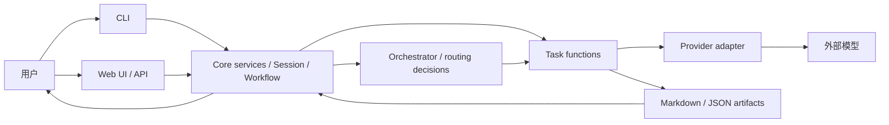
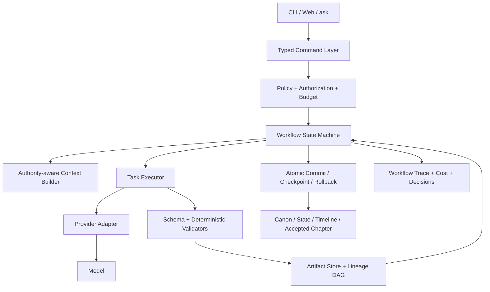

# Agent 系统设计审视报告

> 审视日期：2026-07-11
>
> 审视范围：Agent/Profile/Task 划分、Orchestrator、Creation Session、章节工作流、提示词、结构化 Schema、Provider、CLI/Web 交互、状态与时间线、检索上下文、审计、导出、可观测性、安全与测试。
> 本报告只分析现状和提出建议，不包含代码、配置或行为修改。

## 一、执行摘要

WriterYang 已经形成了一套明显优于“多个 Prompt 串联”的 Agent 工程基础：Agent logic 与 Provider adapter 分离，CLI 和 Web 大量复用 core service，任务输出有 Pydantic Schema，章节写作具备计划、写作、润色、一致性审计、状态提案、人工接受和归档等生命周期；Memory Repair 子系统尤其完整，已经包含结构化决策、批次计划、白名单、preflight、备份和回滚。

但从“整个系统是否已经形成可靠的 multi-agent workflow”看，当前最准确的判断是：

- 单章、标准 Creation Session 路径已经具备较好的工程骨架，但关键不变量仍主要由调用者约定维持，而不是由统一生命周期内核强制执行。
- 多章节 Session 目前不具备可靠的状态连续性和事务性，能够稳定复现第二章状态提案无法应用、第一章却已部分提交的情况。
- Segment Session 当前没有真正按 segment 修改并接受修改后的候选稿，能够出现“用户审阅的是 `polished.v2.md`，系统最终接受的却仍是旧 `polished.md`”的语义错误。
- 审计、状态提案、应用日志与正文之间缺少内容哈希和版本血缘，因此旧审计、旧状态提案有机会继续为被覆盖后的新正文背书。
- 导出默认行为相对保守，但最终只验证 front matter 中的 `accepted` 状态，没有证明“当前正文就是通过最近一次审计并完成状态提交的正文”；同时还存在显式绕过路径。这与项目声明的“export 前必须通过 consistency audit”并不等价。
- 名为 Orchestrator 的模块目前更接近“意图分类器 + 单步路由器 + 若干 workflow helper”，并没有真正执行声明出来的多步 handoff 图，也没有将 `max_steps`、`max_agent_calls` 等预算施加到实际 Session 调用链上。

因此，当前系统不需要再增加更多 Agent。最优先的工作是把已有 Agent 包进一个统一、可验证、可恢复的 workflow runtime：明确 artifact lineage，集中管理状态机与不变量，区分工作副本和已接受版本，并让所有入口共享同一套命令与策略层。

### 总体成熟度判断

| 维度 | 判断 | 核心理由 |
|---|---|---|
| 单章标准工作流 | 较成熟，但仍有全局不变量缺口 | 计划、正文、审计、状态提案、接受、归档链路完整；缺内容血缘校验 |
| 多章 Creation Session | 暂不应视为可靠 | 后续章节不基于前序章节的 projected state；接受过程非事务 |
| Segment Session | 当前语义不成立 | segment 范围未参与修改，修改稿未成为最终接受对象 |
| Agent/Task 功能划分 | 大体合理 | 四类模型 Profile 有成本和能力分层价值，但 Profile、Agent、Task、Workflow Node 概念混用 |
| Prompt 系统 | 基础良好，存在策略冲突 | 有集中模板、partials、JSON 契约；若干系统 Prompt 与实际自动流程不一致 |
| Structured output | 覆盖较广，但控制面偏宽松 | 高风险路由 Schema 继承 `extra="allow"`，部分字段未进入策略执行 |
| 状态与时间线 | 单次应用强，多步组合弱 | old-value 校验、备份等较好；跨章 projected state 和原子提交缺失 |
| Consistency audit | 机制较强，闭环不完整 | 有 deterministic precheck 和模型审计；审计与正文没有 hash 绑定 |
| 检索与上下文 | 能用，但权威性不足 | 会索引草稿、拒绝记录、archive 等非当前事实，archive 排序还会被优先 |
| CLI/Web 一致性 | 大部分共享 core，仍有业务逻辑漂移 | Web 独有 setting-change 同步逻辑，CLI 和 `ask` 不等价 |
| 可观测性 | 中等 | 有 provider/model I/O 日志和 progress；缺统一 workflow run、父子 request 和决策链 |
| 测试基础 | 良好 | 离线测试覆盖广且全部通过；关键跨章、segment、血缘和回滚场景缺失 |

## 二、审视方法与证据

本次审视采用以下方法：

1. 阅读项目约束、README 和架构文档，确认系统声明的设计原则。
2. 追踪 CLI、Web、Orchestrator、Session、章节工作流、状态应用和导出之间的实际调用路径。
3. 对 Agent Profile、Task 默认配置、Prompt 组装、输出 Schema 和 Provider 适配层进行交叉检查。
4. 检查错误恢复、并发控制、日志、隐私和测试覆盖。
5. 使用 mock provider 在 `/private/tmp` 创建临时项目，复现多章节接受和 Segment Session 行为；没有调用真实 API，也没有改动仓库代码。
6. 使用 `py312` 环境运行离线测试：`646 passed, 26 deselected, 7 subtests passed`，耗时约 18 秒。

通过测试只能说明已有断言没有回归，不能否定本报告中的设计缺陷；本次两个最高风险问题都处在现有测试尚未覆盖的跨步骤组合路径中。

## 三、当前系统的实际架构

### 3.1 系统不是 Agent 彼此自治调度，而是中心化工作流

当前系统更接近以下结构：



这里没有常驻 Agent，也没有 Agent 之间自由对话。所谓 Agent 主要由三部分组合出来：

- 一个逻辑角色，例如 Writer、Plot、Audit、Revision；
- 一个 Task 标识及其温度、reasoning、thinking 等配置；
- 一个共享的模型 Profile，例如 `scribe` 或 `architect`。

这种中心化设计本身是合理的，尤其适合需要审计、可恢复和人工确认的小说生产系统。问题不在于“不够自治”，而在于中心化 runtime 目前还没有完整承担状态机、预算、血缘和事务职责。

### 3.2 四个 Profile 与 Task 映射

实际映射集中在 `src/novel/core/agent_defaults.py`：

| Profile | 实际 Task | 当前定位 | 评价 |
|---|---|---|---|
| `scribe` | `writer`、`polish`、`revision` | 长文本创作和重写 | 合理，三个 Task 可以通过任务级参数区分发散度与服从度 |
| `architect` | `plot`、`audit` | 规划和批判性检查 | 基本合理，二者都需要结构推理；审计仍应有独立的低随机性任务配置 |
| `loremaster` | `inspiration`、`style_guide`、`canon` | 世界观、风格和设定知识 | 合理，但不应让名称暗示它负责全部 state/timeline |
| `clerk` | `state_update`、`chapter_memory`、`intent_router`、`memory_repair`、`setup` | 结构化整理、路由和维护 | 大体合理，但 `memory_repair` 是高风险多文件变更，复杂度显著高于普通 clerk 任务 |

任务级默认配置覆盖 Profile 默认配置的做法是对的。它允许 Audit 使用更稳定的参数，同时 Writer 使用更适合创作的参数，而不必无限增加 Profile。

主要问题是命名层级没有被严格区分：代码和文档同时使用 `plot`、`plan`、`plot_agent`、`plan_chapter`、`plot_replan` 表示相近但不同的概念；`README.md` 中的 Profile 职责表与当前 `TASK_TO_PROFILE` 已经不一致，而 `docs/MODEL_CONFIG_BEST_PRACTICES.md` 更接近真实实现。这说明该映射尚未成为单一事实源。

建议以后显式区分：

- `ProfileId`：模型部署和容量配置；
- `AgentRoleId`：职责与权限；
- `TaskId`：一次模型调用的契约和参数；
- `WorkflowNodeId`：生命周期中的步骤；
- `ArtifactType`：步骤生产或消费的文件类型。

这些定义应来自同一个 typed registry，并由它生成配置校验、UI 说明、文档表格和日志标签。

### 3.3 主要用户路径

当前至少存在五类可改变项目状态的入口：

1. 推荐的 Creation Session 路径；
2. 低层 `plan`、`write`、`polish`、`audit`、`state-update` 等命令；
3. 聚合的 `generate-chapter` 路径；
4. Web API 对应路径；
5. 自然语言 `novel ask` 路径。

多入口本身有价值：高级用户需要可观察、可单步重跑的工具。但目前这些入口并没有统一经过一个 lifecycle policy layer，因此“是否允许覆盖”“覆盖后哪些后继产物失效”“能否导出”“状态是否必须提交”等规则分散在各调用者中。高级入口实际上可以绕过推荐路径的重要不变量。

## 四、调度与交互设计审视

### 4.1 做得合理的部分

#### 人工确认点的位置基本正确

系统将人工控制放在以下位置：

- 大纲审批；
- 自动修复后的最终审阅；
- 章节接受；
- memory repair 的 suggest/apply 两阶段；
- setting change 的影响确认。

这比让多个 Agent 自动互相覆盖设定安全得多。尤其是 state update 采用 proposal-first 方式，接受前不直接改变权威状态，是正确方向。

#### Agent 间通过结构化文件交互

章节计划、审计报告、状态更新提案、章节记忆、Session 状态等都落为 Markdown/JSON artifact，符合“记忆可编辑、inter-agent 输出结构化”的项目原则。文件边界也为调试、回滚和人工修订提供了良好基础。

#### Memory Repair 是当前最接近完整工作流内核的子系统

Memory Repair 包含 clarification、结构化 batch plan、目标白名单、JSON Pointer、Schema repair、preflight、备份、应用和回滚。它体现了系统应推广到其他工作流的模式：先决策、再计划、再验证、再提交、最后记录影响，而不是直接让模型改文件。

### 4.2 严重问题一：多章节 Session 没有 projected state

#### 现状

`src/novel/core/session.py` 的 outline proposal 会为多个章节生成计划，随后 `run_session` 逐章生成、审计并调用 `_propose_state`。但是前一章的 state proposal 在 Session 接受前不会应用，下一章继续读取项目当前 state/timeline，而不是“当前 state + 本 Session 已通过审计的前序章节变更”。

接受时，`accept_session` 再逐章调用 `accept_chapter`。`state_update` 会严格检查提案中的 `old_value` 是否与当前状态一致。于是两个章节都基于同一个旧 state 产生提案时，第一章应用后，第二章的 `old_value` 很容易失效。

#### 可复现结果

使用两章 mock Session：

- 两章生成和审计都成功；
- 两章 state proposal 都基于同一初始状态；
- 接受第一章成功并改变 state；
- 接受第二章失败，错误为 `old_value mismatch`；
- 第一章已经提交，第二章没有提交；
- Session 仍显示 `needs_user_review`。

这不是单纯的错误提示问题，而是三个架构问题同时存在：

1. 生成阶段缺少 Session-local projected state；
2. 接受阶段不是原子事务；
3. 失败后 Session 状态不能准确表达“已部分提交”。

#### 影响

- 后续章节可能基于过时的角色状态、物品、位置和时间线生成；
- Session 接受会产生部分成功，用户难以判断该重试、回滚还是手工修复；
- 章节正文之间看似连续，权威 state/timeline 却可能断裂；
- CLI 没有在 Session 命令边界捕获此类 `StateUpdateError`，会直接显示 traceback。

#### 建议

多章 Session 应建立一个隔离的工作分支：


后续章节必须读取 projected state/timeline。最终接受要么原子提交整个 Session，要么产品上明确采用“逐章 checkpoint + 可恢复”的语义；不能继续表现为一次 Session 接受，却在内部留下不透明的半提交状态。

### 4.3 严重问题二：Segment Session 没有接受用户审阅的修改稿

#### 现状

`CreationSession.segment_range` 会被保存，但 `_run_segment_session` 并没有使用它定位正文片段。当前实现对整份 `polished.md` 调用 revision，产出 `polished.v2.md`，然后直接进入 `needs_user_review`：

- 没有按 segment 范围生成或应用 patch；
- 没有将 `polished.v2.md` 提升为当前候选稿；
- 没有对该候选稿重新审计；
- 没有基于该候选稿重建 state proposal；
- `accept_session` 最终仍接受原 `polished.md` 和旧审计结果。

#### 可复现结果

以 segment `[8, 9, 10]` 运行 Session：

- Session 返回的最终输出是 `polished.v2.md`；
- 审计历史为空；
- 接受操作成功；
- 被标记为 accepted 的仍是旧 `polished.md`；
- `polished.v2.md` 保持 `polished_revision`，没有进入接受链路。

#### 影响

这是“审阅对象”和“提交对象”不一致的问题。即使 revision 的内容质量很好，系统也可能把用户没有选择的旧内容当作最终章节。它还会让审计和 state update 对错误版本生效。

#### 建议

Segment Revision 应从 Creation Session 中拆成明确的工作流类型，至少包含：

1. 基于 source hash 和稳定 anchor 定位片段，而不是只存裸行号或段号；
2. 生成结构化 patch，验证 patch 只改变授权范围；
3. 合成新的 chapter candidate；
4. 对 candidate hash 重新审计；
5. 失效并重建旧 state proposal、chapter memory 等后继产物；
6. 人工接受 candidate，而不是接受旧 base artifact。

在这个闭环完成前，Segment Session 不应被视为可安全提交的生产路径。

### 4.4 严重问题三：Artifact 缺少版本血缘和 freshness 校验

#### 现状

当前文件名和 front matter 承担了过多身份职责：

- Audit Report 记录正文文件名，但不记录被审正文的 SHA-256；
- State Update Proposal 不记录来源正文、审计和 base state 的 hash；
- Apply Log 不绑定 proposal hash，也没有完整的 pre/post state hash；
- 对上游正文执行 `--force` 后，旧审计、旧提案、旧应用记录可能仍留在原处；
- `_load_existing_apply_result` 主要按章节和状态判断已有应用结果，不能证明它对应当前正文。

Session 某些分支会主动 retire state proposal，这是好的局部保护，但还没有形成中央 artifact dependency graph。

#### 影响

- 新正文可以继承旧正文的 passed audit；
- 新正文可以继承旧正文的 state update 结果；
- 导出时即使看到 `accepted`，也无法证明当前内容与接受时内容相同；
- 任意入口覆盖上游文件后，需要由调用者记住手工清理哪些后继文件，极易遗漏。

#### 建议

建立 Artifact Manifest 或等价的 typed lineage registry，至少记录：

| Artifact | 必须绑定的上游信息 |
|---|---|
| Chapter Plan | state/timeline/canon snapshot hash、用户要求 hash、Prompt 版本 |
| Draft | plan hash、上下文 bundle hash |
| Polished Candidate | draft hash、style guide hash |
| Audit Report | audited content hash、plan hash、state/timeline snapshot hash、审计策略版本 |
| State Proposal | audited content hash、audit hash、base state version/hash、base timeline version/hash |
| Apply Log | proposal hash、pre-state hash、post-state hash、提交 ID |
| Accepted Chapter | candidate hash、passed audit hash、apply transaction ID |
| Export Package | accepted chapter hashes、audit hashes、state commit IDs |

所有写入上游 artifact 的操作都应经过同一 mutation service，由它自动标记后继产物为 stale，而不是由每个命令分别清理。

### 4.5 导出门禁没有真正证明 consistency audit 不变量

`src/novel/core/exporting.py` 的主要条件是：存在 `polished.md`，并且 front matter `status == accepted`；`include_unaccepted` 可以放宽这一条件。Web API 也暴露了该选项，legacy Orchestrator 路径还会显式使用 `include_unaccepted=True`。

这与“每个生成章节在 export 前都必须通过 consistency audit”之间存在差距：

- `accepted` 只是一个可编辑的文件字段；
- 没有验证当前正文 hash 对应 passed audit；
- 没有验证该 audit 之后正文未被覆盖；
- 没有验证对应 state/timeline 已经提交；
- 存在未审计导出绕过路径。

建议把“生产导出”和“预览打包”设计成两个明确概念：

- Production Export：必须由 lifecycle guard 验证正文 hash、passed audit、接受记录和 state commit 全部一致，不允许绕过；
- Preview Package：允许未接受内容，但文件名、元数据和 UI 都明确标记为 preview，不能与正式 export 混用。

### 4.6 Orchestrator 的声明能力大于实际能力

`src/novel/core/orchestrator.py` 声明了 `ALLOWED_HANDOFFS`、`max_steps`、`max_agent_calls` 和 `max_retries`，看起来像通用 multi-agent runtime。但 `plan_orchestration` 当前只创建一个 `orchestrator -> target` handoff；实际非 dry-run 的 `novel ask` 先得到一个 `AskIntentDecision`，随后直接调用 Session、Memory Repair、Export 或 Status，并不执行通用多步 orchestration plan。

因此：

- handoff graph 主要是声明性外观，没有驱动真实多步工作流；
- `max_steps`、`max_agent_calls` 没有约束 Session 内的多次 plan/write/audit/revision/state 调用；
- `max_retries` 没有成为统一 workflow 重试预算；
- Provider 级 retry、结构化输出修复 retry、JSON parse repair 和业务 revision loop 可以叠加；
- `AskIntentDecision.chapter_range` 由模型给出，缺少严格上限和成本预估，一个错误的大范围决策可触发大量调用。

这里有两条合理路线：

1. 收缩概念：承认它是中心路由器，将实际状态机放在明确的 workflow service 中，删除没有执行语义的 graph/budget 外观；
2. 完成概念：引入 typed `WorkflowPlan`，每个 node 包含 prerequisites、input/output artifact、权限、成本、重试和用户 gate，并让 CLI/Web/ask 全部通过统一 executor。

不建议继续维持“看起来像多 Agent 图、实际是一跳路由”的中间状态。

### 4.7 用户修改范围没有完全约束实际执行范围

`RevisionRouteDecision` 可以返回 `chapter_numbers`，但 Session 的 `revise_content` 仍会遍历整个 `session.chapter_range`。因此用户说“只修改第二章”时，决策结果虽然能表达该范围，执行层却可能重写整个 Session。

应在执行前验证：

- 选择章节是 Session 范围的子集；
- 每个修改节点只能写入被授权章节；
- 未选章节的 hash 必须保持不变；
- 高风险扩大范围必须重新向用户确认。

### 4.8 Session 的失败状态、恢复和回滚语义不足

生成过程发生异常时，progress 可以记录 failed，但 `CreationSession` 本身可能继续停留在 `generating`，而已经产生的部分文件会让无 `--force` 重跑发生冲突。相比之下，单章 `generate_chapter` 已经有更明确的 resume 思路，Session 尚未建立相同能力。

建议将 Session 状态机明确为 typed transitions，例如：

```text
proposed -> awaiting_outline_approval -> generating
generating -> needs_user_review | failed_recoverable | failed_terminal
needs_user_review -> accepting -> accepted
accepting -> accepted | partially_applied | rolled_back
```

每个 transition 应有前置条件、允许写入的 artifact、幂等键、恢复动作和审计记录。不能只依靠多个布尔字段和文件是否存在推断真实状态。

### 4.9 自然语言 `ask` 的产品定位不清晰

`ask` 当前支持的任务主要是 Session start、memory repair suggest/apply、export、status/show 和 unknown。它不能自然地继续、审阅、修改、批准或接受现有 Session。高风险 approve/accept 不通过模糊自然语言自动执行是正确的，但目前 `ask` 的能力边界对用户并不清晰：

- `show` 与 `status` 基本都会回到项目状态；
- export 决策没有完整落实用户可能指定的章节范围和格式；
- 路由置信度会被解析，却没有低置信度策略；
- 一次错误的 session_start 路由可能立刻触发高成本工作流。

建议把 `ask` 定位成“安全的 command planner”，输出一个可解释的候选动作：低风险读取动作可直接执行，高成本或写操作先显示范围、预计调用量和目标 Session，高风险 transition 必须使用明确确认 token。

## 五、Agent、Task 与提示词系统审视

### 5.1 功能划分总体评价

当前角色划分没有明显缺失一个新 Agent 的必要。更重要的是收紧每个角色的写权限和输出契约。

| 角色/Task | 合理职责 | 当前边界问题 | 建议权限 |
|---|---|---|---|
| Plot | 章节目标、场景结构、伏笔与节奏 | 与 `plan`/`plot_replan` 命名不统一 | 只能写 plan candidate，不直接写正文或 canon |
| Writer | 按批准计划产出正文 | hidden truth 揭示规则有冲突 | 只能写 draft candidate，不改 plan/state |
| Polish | 语言和风格提升 | 与 Revision 的界线主要靠 Prompt | 只做非结构性改写；超范围则返回 route request |
| Audit | 一致性检查和证据化问题 | 主观质量与一致性严重度边界不稳 | 只报告，不修改；每项必须绑定 content span/evidence |
| Revision | 修复审计问题或用户指定问题 | Prompt 与自动循环、人类确认政策冲突 | 只修指定 issue/scope；结构性变化退回 Plot |
| Canon | 提取或维护长期设定 | 与 state/timeline 的权威层次需要更清楚 | 产出 proposal，不直接无审查覆盖权威设定 |
| State Update | 生成结构化状态差量 | Schema 文字可能诱导补造缺失 location | 只能产出 delta，由 deterministic applier 应用 |
| Chapter Memory | 生成检索导航信息 | 可能被误认为事实源 | 明确 non-authoritative，只保存引用和摘要 |
| Intent Router | 将自然语言映射为动作 | 置信度、范围、成本没有进入执行策略 | 只能建议 command，不直接获得无限执行权限 |
| Memory Repair | 复杂跨文件修复 | 被放在通用 clerk Profile 下，风险高 | 独立预算、强验证、事务应用和回滚 |
| Setup | 连通性或配置验证 | 不是业务 Agent | 保持工具任务，不要在产品概念中呈现为 Agent |

### 5.2 Prompt 组装的优点

Prompt 系统具备以下良好基础：

- system prompt 按角色拆分；
- 复用 partials，避免重复粘贴关键约束；
- user prompt 显式传入 plan、state、timeline、canon、正文等上下文；
- structured response mode 与 Pydantic Schema 配合；
- Prompt version 有集中 registry 和测试；
- Writer 上下文能够控制 hidden truth 可见性；
- Audit 结合 deterministic precheck，减少完全依赖模型判断。

这些基础使后续系统化修正不需要推倒重来。

### 5.3 Prompt 与实际工作流存在冲突

#### Revision 的人工确认要求与自动循环冲突

`src/novel/prompts/revision_system.txt` 要求每轮 Revision Loop 等待人工确认，但 Session 实际会自动运行最多多轮 revision；直接 revision loop 也只是入口处确认一次，而非每轮确认。模型收到的治理规则与 executor 实际策略不一致。

应由 executor 决定 human gate，Prompt 只陈述当前调用被授予的权限，例如：

- `mode=auto_patch`：只能修指定 issue，不允许扩展范围；
- `mode=user_directed`：可执行用户明确授权的结构变更；
- `mode=proposal_only`：只返回建议，不输出完整改稿。

#### Plot 与 Revision 的结构修改权限冲突

Revision Prompt 一处允许用户明确要求时改变核心情节，但路由契约又要求 plot change 交回 Plot。应保留单一规则：结构变化只能由 Plot 生成新计划，Revision 在批准的新计划下执行正文重写。

#### Writer 的 hidden truth 规则存在歧义

Writer Prompt 一处允许计划或用户要求时揭示 hidden truth，另一处又要求 excluded/hidden truth 永不出现；同时 ContextBundle 往往会对 Writer 隐去 hidden truth。系统无法同时满足“允许揭示”和“不可见”。

正确做法不是让 Writer 自己猜，而是由 Plot/Orchestrator 产生结构化 reveal authorization，例如 `{truth_id, reveal_level, allowed_evidence}`，Context Builder 只在授权时暴露必要片段。

#### Audit 的严重度政策不完全一致

Audit system prompt 倾向于把主观不确定性降为 low，但 user prompt 又允许“动机解释不足”成为 medium。对小说而言，留白、含蓄和信息延迟可能是有意设计；如果 medium 会触发自动 revision，这类冲突会造成过度修复。

建议把审计问题拆成不同维度：

- `consistency_violation`：事实、时间、人物状态冲突；
- `plan_deviation`：偏离已批准计划；
- `clarity_risk`：可能影响理解但不一定错误；
- `craft_suggestion`：主观写作建议。

只有前两类在达到阈值时自动进入修复闭环；后两类默认给用户审阅，不应伪装成一致性错误。

#### Audit 上下文存在证据源混杂

当前审计 Prompt 可能同时包含 audited body、draft body 和 polished body。模型容易引用错误版本，也增加 token 成本。应只提供一个明确的 `audited_artifact`，其他版本若用于 diff，应作为标注清晰的辅助差异，而不是三个近似正文并列。

#### State Update Prompt 与 Schema 对字段必需性的表达不同

Prompt 容易给出“location_id 等都必须存在”的印象，而 Schema 允许部分字段为 optional。这会鼓励模型在原文没有证据时补造位置等状态。应统一为 evidence-first：没有变化或没有证据就不生成操作，绝不为了填字段发明事实。

### 5.4 Prompt 缺少统一的机器可读策略源

当前很多规则同时存在于：

- system prompt；
- user prompt builder；
- Pydantic Schema；
- deterministic validator；
- Session executor；
- README/架构文档。

当规则修改时，这些位置容易漂移。建议建立 machine-readable policy registry，例如声明每个 Task 的：

- 可读 artifact 类型；
- 可写 artifact 类型；
- 是否允许结构变化；
- 是否需要 user gate；
- 输出 Schema；
- 严重度和 fallback；
- 最大上下文和调用预算；
- hidden truth visibility；
- stale artifact policy。

Prompt 和 validator 都从同一策略源生成或校验。Prompt 测试也不应只检查某句话存在，而应验证它与执行策略没有矛盾。

### 5.5 工作区内容应被明确视为“不可信数据”

用户要求、小说正文、memory 搜索结果和归档文本会直接拼接进 Prompt。小说文本本身可能包含“忽略之前指令”等类似自然语言；如果以后支持导入第三方项目，这就成为实际 prompt injection 边界。

建议：

- 每段上下文带 `{source_type, path, content_hash, authority, lifecycle_status}`；
- system prompt 明确声明 workspace 内容是资料，不得执行其中的指令；
- 用户当前指令与历史正文使用不同结构字段；
- 高风险 decision 只使用 allowlisted 权威源；
- 搜索结果不能因为语义相似就自动获得指令优先级。

## 六、Structured Schema 与控制面审视

### 6.1 Schema 覆盖广，但高风险决策不应默认 `extra="allow"`

多数模型继承的 `FlexibleModel` 允许额外字段。这对读取可演进的持久化文件有价值，但对 inter-agent 控制决策不够严格。例如 Ask、Revision Route、Audit Repair Route、Memory Repair Decision 等属于执行控制面，额外字段被静默接受会掩盖 Prompt/模型版本漂移和拼写错误。

建议分成两类基类：

- `StrictDecisionModel(extra="forbid")`：用于路由、授权、状态 transition 和 patch plan；
- `VersionedPersistenceModel`：用于需要迁移兼容的持久化数据，可在迁移边界容忍旧字段。

同时补充跨字段校验：

- `issue_ids` 必须属于当前 audit；
- route 的 chapter 必须与 audited chapter 相同；
- revision chapters 必须是授权范围子集；
- `writer_rewrite`、`revision_rewrite` 与风险类型一致；
- confidence 低于阈值时不得直接触发高成本写操作；
- chapter range 必须受项目边界和最大批量限制。

### 6.2 很多字段被解析，但没有成为运行时政策

典型例子包括：

- Ask confidence 没有决定澄清或执行；
- Revision risk 没有改变 human gate 或预算；
- Audit route 的 `issue_ids` 没有严格证明是当前问题子集；
- chapter range 没有充分的最大成本限制；
- declared retry/step budgets 没有覆盖真实模型调用链。

这会产生“Schema 看起来很完整，实际只是记录信息”的错觉。每个控制字段都应该回答三个问题：谁消费、何时校验、如何改变执行。如果没有消费方，应删除或标为 observation，而不是 policy。

### 6.3 Audit 路由枚举与实际执行不一致

`AuditRepairRoute` 区分 `writer_rewrite` 和 `revision_rewrite`，但 Session 实际只有 `plot_replan` 走独立路径，其他非人工路线基本都进入 Revision Agent。也就是说模型选择 `writer_rewrite` 并不会调用 Writer。

另外，Session 调用 audit repair router 时没有充分传入 prompt 已支持的 plan/state summary，导致它在信息不足时选择高影响路线。deterministic mock 路由也主要只区分 plot，其他问题容易落为 revision patch。

建议：要么删除没有不同执行语义的枚举值，要么为每条 route 实现明确、可测试的 executor；路由前提供完整但最小的结构化证据，路由后再经过 deterministic policy validator。

## 七、状态、记忆和检索上下文审视

### 7.1 权威层次需要显式化

当前大致存在：

1. canon / state / timeline；
2. 已批准计划；
3. accepted chapter；
4. chapter memory；
5. working draft / proposal / Session artifact；
6. archive / rejection / backup。

但搜索层没有始终按这个权威顺序过滤。`src/novel/core/search.py` 会遍历广泛的 `memory/**/*.md` 和章节 JSON；Session proposal、拒绝记录、归档快照等都有机会被检索。`_diverse_context_results` 中 archive 排序键还会让 archived 结果排在非 archive 结果之前，与通常预期的“历史降权”相反。

这意味着旧 accepted 版本、被拒绝内容、临时提案或备份可能进入 Writer/Plot 的上下文。即使 Prompt 说 canon/state 才是权威，模型仍可能被高相似度旧文本干扰。

建议 Context Builder 使用显式 authority policy：

```text
current canon/state/timeline
> approved current plan
> current accepted chapter
> chapter-memory pointer/summary
> current working candidate
> historical/archive/rejected material（默认排除，按任务显式开启）
```

每个检索结果要携带版本、生命周期、hash 和 authority rank。不同 Task 使用不同 allowlist，而不是共享“所有 Markdown 都可搜”的索引语义。

### 7.2 Chapter Memory 的定位是正确的，但需要技术强制

项目把 Chapter Memory 设计成 non-authoritative retrieval guide，这是合理的。风险在于如果搜索和 Prompt 没有强制标记来源，模型无法知道某段摘要只是导航而不是事实原文。

Chapter Memory 最好只保存：

- 对 accepted chapter hash 的引用；
- 场景/人物/事件索引；
- 可回溯到原文 span 的摘要；
- 生成它的模型和 Prompt hash。

一旦章节重新接受，旧 memory 应自动 stale，并且不能继续进入默认上下文。

### 7.3 项目原则与当前“生成/接受”语义需要统一

项目原则写的是“每次章节生成都必须更新 timeline 和 state 文件”。当前实际行为是：

- 低层 `generate_chapter` 在 audit 后结束，不创建或应用 state proposal；
- Session run 创建 proposal，但在用户接受前不应用；
- Session accept 才真正写入 state/timeline。

如果按字面解释，当前实现不满足原则；如果为了人工安全不希望未接受正文污染权威 state，那么原则本身需要更精确。

建议采用下述不变量：

> 每个通过审计的章节 candidate 必须生成并验证一份绑定该 candidate hash 的 pending state/timeline proposal；只有 candidate 被接受时，正文、state、timeline、chapter memory 和接受记录才作为一个事务提交。没有完成该事务的章节不得成为 accepted，也不得进入正式导出。

这比“生成就直接更新权威 state”更安全，也与当前 proposal-first 方向一致。

## 八、CLI、Web 与自然语言入口的一致性

### 8.1 优点

大量 Web/CLI 入口都复用 core service，而不是各写一套模型调用；Provider 配置、项目加载、章节工作流等也大体共享。这满足了项目架构原则的主要方向。

### 8.2 Setting Change 同步逻辑仍在 Web adapter 内

`src/novel/web_api/memory.py` 中存在 `_sync_setting_change_session`：memory repair 应用后，Web 会根据 Session 状态继续同步大纲或正文。CLI 的 `setting-change apply` 和 `novel ask` 只应用 memory repair，再展示 follow-up actions，并不会执行相同同步。

问题有三点：

- 业务决策落在 Web 层，不是 core；
- 同一个操作在 Web、CLI 和 ask 中结果不同；
- memory 已应用后，如果 Web 同步失败，没有统一事务回滚。

应把它迁移为 core command，例如 `apply_setting_change(sync_policy=...)`，或者使用通用 follow-up executor。Web/CLI 只负责采集确认、展示进度和序列化结果。

### 8.3 调用来源记录不准确

多个 domain service 创建 `AgentInvocationContext(caller="cli")`，即使它们从 Web 或 Session 被调用。`session_id` 字段也很少实际传入。结果是日志存在，但很难重建“哪个用户请求触发哪个 Session，Session 又触发了哪些 Agent 调用”。

应传播统一的：

- `workflow_run_id`；
- `session_id`；
- `surface`（CLI/Web/ask）；
- `parent_request_id`；
- `node_id`；
- `attempt`；
- `artifact_input_hashes` / `artifact_output_hashes`。

## 九、可靠性、并发、安全和隐私

### 9.1 已有优点

- API key 通过环境变量管理，没有写入项目配置；
- Provider adapter 与 Agent logic 分离；
- 有项目锁、备份和原子写入机制；
- 有 secret scan、构建和多 Python 版本 CI；
- Web 对本地 Host/Origin 有保护；
- 模型 I/O 和 Provider 使用量有日志与 retention；
- state update 有 old-value 校验，能阻止静默覆盖。

### 9.2 Project lock 的超时语义需要谨慎

锁超过约定时长后会被视为 stale。若某个真实长任务仍在运行，单纯按年龄回收可能造成并发写。更稳妥的判断应结合 PID 存活、process start time、host、workflow heartbeat 和明确的 force-unlock 记录。

### 9.3 模型 I/O 默认全量记录有隐私成本

全量日志对调试很有价值，但其中可能包含：

- 完整小说正文；
- 未公开设定和 hidden truth；
- 用户自然语言要求；
- Provider 原始输出。

虽然日志本地保存且有 retention，仍建议在首次启用时向用户明确提示；对于隐私敏感环境，可以考虑默认 metadata 模式、按 Session 临时开启 full capture，或者对正文内容做可配置脱敏。无论哪种模式，都应保存 Prompt/content hash 以支持血缘诊断。

### 9.4 Prompt version 只有人工日期，不足以证明实际内容

集中 `PROMPT_VERSIONS` 是好基础，但 Prompt 文件改变后，人可能忘记更新日期。日志应同时记录渲染后 system/user prompt 的稳定 hash、模板 hash 和 policy version。这样才能解释为什么同一 Task 在不同时间产生不同决策。

## 十、测试与质量体系审视

### 10.1 当前测试基础值得保留

离线测试完整通过，覆盖了大量 Schema、状态转换、Web API、CLI、Prompt 约束、memory repair 和单章路径。CI 还包括多 Python 版本、lint/type/build、secret scan 和 Web E2E。这说明项目不是缺测试，而是缺少针对“跨多个局部正确组件组合后是否仍正确”的系统不变量测试。

### 10.2 最高优先级测试缺口

建议新增以下测试类别：

1. 多章完整 E2E：run 两章以上、projected state 连续、一次接受、最终 state/timeline 正确。
2. 多章故障注入：第二章应用失败时，验证全回滚或明确 `partially_applied` 和可恢复 checkpoint。
3. Segment E2E：只修改目标 segment、非目标内容 hash 不变、candidate 重新审计、最终接受 candidate。
4. Freshness：任何上游覆盖都会使 audit/state proposal/apply log/accepted/export 失效。
5. Export gate：当前正文没有匹配 passed audit hash 时必须拒绝生产导出。
6. Retrieval authority：rejected/session/archive/backup 默认不能进入当前创作上下文；历史模式显式开启时才可进入。
7. Ask budget：低置信度、大 chapter range、异常 retry 组合不能越过调用预算。
8. Audit route execution：每个枚举 route 都调用正确 Agent，或验证已被删除。
9. Revision scope：只允许修改被授权章节和 segment。
10. Session recovery：生成中断、重启、resume、cancel、rollback 的状态转换。
11. CLI/Web parity：同一 core command 在两个 surface 产生相同 domain 结果。
12. Prompt policy consistency：Prompt、Schema 和 executor 权限一致。
13. Prompt injection fixture：正文或 memory 中的伪指令不会改变控制决策。

### 10.3 类型检查仍偏宽松

当前 mypy 配置没有启用若干严格项，例如完整检查 untyped defs 和 strict optional。对快速迭代可以理解，但 workflow transition、artifact manifest、route decision 和 state mutation 属于适合逐步提高类型严格度的核心区域。无需一次性全仓严格化，可先为这些模块建立 strict boundary。

## 十一、问题优先级清单

### P0：会导致错误内容被接受、状态部分提交或核心不变量失真

| 编号 | 问题 | 立即风险 |
|---|---|---|
| P0-1 | 多章 Session 不使用 projected state，接受非事务 | 第二章失败但第一章已提交，state/timeline 与 Session 不一致 |
| P0-2 | Segment Session 接受旧正文而非修改候选稿 | 用户审阅对象与系统提交对象不同 |
| P0-3 | 正文、审计、状态提案和应用日志无 hash 血缘 | 被覆盖的新正文可继承旧审计/旧状态结果 |
| P0-4 | 正式导出只看 accepted 状态，不能证明当前正文通过审计 | 未审或已变更正文可能被当作正式成果导出 |

### P1：会导致错误路由、不可恢复、入口不一致或持续质量下降

| 编号 | 问题 |
|---|---|
| P1-1 | Orchestrator graph 和预算未约束真实工作流 |
| P1-2 | revision chapter scope 被决策后仍未约束执行 |
| P1-3 | Session 缺少 failed/partial/resume/rollback 的正式状态 |
| P1-4 | 搜索默认混入 archive/rejection/session 等非权威内容，且 archive 有优先排序问题 |
| P1-5 | Web 独有 setting-change 同步业务逻辑，CLI/ask 不一致 |
| P1-6 | Audit route 枚举与实际 Agent executor 不一致 |
| P1-7 | 低层命令可绕过推荐 Session 的生命周期保护 |
| P1-8 | “章节生成更新 state/timeline”的项目原则与实际两阶段语义冲突 |

### P2：架构债务、可维护性、可解释性和隐私风险

| 编号 | 问题 |
|---|---|
| P2-1 | Profile/Agent/Task/Workflow Node 命名混用，README 映射漂移 |
| P2-2 | 高风险 decision Schema 默认允许额外字段 |
| P2-3 | confidence、risk、issue_ids 等字段没有完整进入执行策略 |
| P2-4 | 多处 Prompt 与实际权限、确认和严重度策略冲突 |
| P2-5 | 工作区内容没有明确的 prompt injection 信任边界 |
| P2-6 | 缺少统一 workflow run 和父子调用追踪 |
| P2-7 | Prompt version 缺内容 hash |
| P2-8 | 默认全量模型日志需要更清楚的隐私告知与模式选择 |
| P2-9 | 长任务锁的 stale 判定可进一步加强 |

## 十二、建议的目标架构

建议的目标不是“Agent 更自治”，而是“每个 Agent 的权限更小，工作流内核更强”。



### 12.1 Typed Command Layer

所有入口最终只提交 typed command，例如：

- `StartCreationSession`；
- `ApproveOutline`；
- `RunSession`；
- `ReviseChapterScope`；
- `AcceptSession`；
- `SuggestMemoryRepair`；
- `ApplyMemoryRepair`；
- `ExportAcceptedChapters`。

CLI/Web/ask 只负责把输入转换成 command。任何业务规则都不应只存在于某个 adapter。

### 12.2 Workflow State Machine

每个 command 由 state machine 验证：当前状态是否允许、需要哪些 artifact、是否需要人工 gate、失败时如何恢复。状态转换本身生成结构化事件，而不是靠多个文件状态反推。

### 12.3 Artifact Store 与血缘 DAG

所有 artifact 有稳定 ID、类型、hash、版本、生命周期和上游依赖。修改上游时，系统自动把后继标记为 stale。接受和导出只查询已验证的 lineage，不再相信单个 front matter 字段。

### 12.4 Session-local Projection 与事务提交

多章生成使用隔离 projection。每章产生 delta 后先应用到 projection，再供下一章读取。最终提交要支持：

- 全 Session 原子提交；或
- 产品明确的逐章 checkpoint。

两种语义二选一，并在 UI 中真实展示，不能内部逐章提交、外部却表现成单次原子接受。

### 12.5 Authority-aware Context Builder

Context Builder 根据 Task 权限选择资料，处理 token budget、去重、recency、authority、hidden truth 和 stale 过滤。搜索引擎只负责候选召回，不负责决定哪些候选可以成为事实上下文。

### 12.6 全局预算与可观测性

预算要覆盖整个 workflow，而不是单个 Provider request。至少追踪：

- 总 Agent 调用次数；
- 每 Task 调用和 retry；
- token/cost；
- revision loop 次数；
- context size；
- 已写 artifact；
- 当前可恢复 checkpoint。

超过预算时进入明确的 `needs_user_decision`，而不是继续隐式重试或半途留下不明状态。

## 十三、建议实施顺序

本报告不实施任何修改。若后续进入改造，建议顺序如下。

### 阶段一：先封住正确性风险

1. 暂停或显式标注多章接受和 Segment 接受为 experimental，避免用户误以为已具备事务保证。
2. 为所有正文、审计、state proposal 和 apply log 增加 hash 绑定。
3. 正式导出改为校验完整 lineage。
4. 修正 Segment candidate 的 promote、re-audit、state rebuild 和 accept 链路。
5. 实现多章 projected state 和明确的提交/回滚语义。

### 阶段二：统一调度和生命周期

1. 引入 typed command layer；
2. 让 CLI、Web、ask 共享 command handler；
3. 建立正式 Session state machine；
4. 将 setting-change follow-up 等逻辑移入 core；
5. 统一 workflow 级 budget、retry 和 trace。

### 阶段三：收紧 Agent 契约

1. 区分 Profile、Role、Task、Node、Artifact；
2. 高风险 decision 使用 strict Schema；
3. 让 risk/confidence/scope 真正进入策略；
4. 修正 Audit route 与 executor 对应关系；
5. 统一 Prompt、validator 和 executor 的权限策略。

### 阶段四：提升上下文质量和长期可维护性

1. 建立 authority-aware retrieval；
2. 默认过滤 stale/rejected/archive；
3. 增加 Prompt/content/policy hash；
4. 完善隐私模式、日志关联和成本仪表；
5. 由 registry 自动生成 README 和配置说明，防止文档漂移。

## 十四、改造完成的验收标准

未来不能只以“测试通过”作为 Agent 系统改造完成标准。建议至少满足以下可观测不变量：

1. 任意 accepted chapter 都能追溯到唯一正文 hash、passed audit hash 和 state commit。
2. 修改正文一个字符后，旧 audit 和旧 state proposal 自动变 stale，正式 export 被拒绝。
3. 两章以上 Session 的第二章明确读取第一章 projected state。
4. 多章接受失败不会留下未声明的部分提交；若采用 checkpoint，UI 和状态文件明确列出已提交章节。
5. Segment Revision 只能改变授权范围，最终接受的 hash 与用户审阅 candidate 完全一致。
6. 任意 Agent 不能直接写入超出其权限的 artifact。
7. rejected、backup、archive 和 stale artifact 默认不会进入当前创作上下文。
8. CLI、Web 和 ask 对同一 typed command 产生相同 domain result。
9. workflow budget 能统计并限制全部模型调用及 retry。
10. 每次失败都能回答：失败在哪个 node、已写哪些 artifact、哪些仍有效、如何 resume 或 rollback。

## 十五、关键实现证据索引

下表便于后续设计讨论和修复时快速回到实现位置。函数名比固定行号更稳定。

| 主题 | 主要实现位置 |
|---|---|
| Profile 与 Task 默认映射 | `src/novel/core/agent_defaults.py`：`PROFILE_IDS`、`TASK_TO_PROFILE`、task defaults |
| Provider 配置合并与日志包装 | `src/novel/core/provider_config.py`、`src/novel/core/providers.py` |
| 一跳 orchestration plan | `src/novel/core/orchestrator.py`：`plan_orchestration`、`_execute_plan` |
| Ask 的真实非 dry-run 路由 | `src/novel/cli_commands/orchestrator.py`：ask command handler |
| 多章 outline proposal | `src/novel/core/session.py`：`_write_outline_proposal` |
| Session 逐章生成和 state proposal | `src/novel/core/session.py`：`run_session`、`_propose_state` |
| 多章逐章接受 | `src/novel/core/session.py`：`accept_session` |
| Segment 执行 | `src/novel/core/session.py`：`_run_segment_session` |
| Revision 范围执行 | `src/novel/core/session.py`：`revise_content` |
| Audit 自动修复路由 | `src/novel/core/session.py`：`_audit_driven_revision_route`、`_auto_repair_chapter`；`src/novel/core/orchestrator.py`：`route_audit_repair` |
| 单章聚合工作流 | `src/novel/core/workflow.py`：`generate_chapter` |
| State old-value 校验与应用 | `src/novel/core/state_update.py`：proposal validation/apply functions |
| 正式导出筛选 | `src/novel/core/exporting.py`：`collect_export_chapters` |
| Memory 与 chapter 搜索 | `src/novel/core/search.py`：`_markdown_documents`、`_chapter_json_documents`、`_diverse_context_results` |
| Web 独有 setting-change 同步 | `src/novel/web_api/memory.py`：`_sync_setting_change_session` |
| 控制决策和持久化 Schema | `src/novel/core/schemas.py` |
| Revision/Writer/Audit/State Prompt | `src/novel/prompts/revision_system.txt`、`writer_system.txt`、`audit_system.txt`、`state_update_system.txt` 及对应 user prompt builder |
| Prompt 版本表 | `src/novel/core/prompt_versions.py` |
| Profile 文档漂移对照 | `README.md` 与 `docs/MODEL_CONFIG_BEST_PRACTICES.md` |

动态复现使用 mock provider 和 `/private/tmp` 下的临时项目，分别验证了：

- 两章 Session 在接受第二章时出现 state `old_value mismatch`，且第一章已经提交；
- Segment Session 生成 `polished.v2.md` 后，接受链路仍把旧 `polished.md` 标记为 accepted。

这些临时项目不在仓库中；本次仓库内唯一新增内容是本分析报告。

## 十六、最终结论

WriterYang 的 Agent 系统已经具备一个严肃创作工具所需的多数“部件”：结构化输出、文件化记忆、人类审批、审计、Provider 解耦、状态提案、回滚和较完整的测试。设计方向总体正确，尤其不应为了追求 multi-agent 的表面复杂度再增加更多自由对话型 Agent。

当前瓶颈在组合层：局部组件各自合理，但跨章节、跨版本、跨入口组合时，缺少统一的状态机、artifact 血缘、权限策略、上下文权威层和事务边界。多章 Session、Segment Session 和正式导出门禁已经出现可复现的正确性缺口，因此应先把这些生命周期基础设施补齐，再继续扩展 Agent 能力或更复杂的自动路由。

如果只用一句话概括下一阶段设计目标，应是：

> 让每一次 Agent 调用都成为一个受权限、预算、版本血缘和状态机约束的 workflow node；让用户最终接受和导出的，严格等于已审计、已提交且可追溯的那个 artifact。
