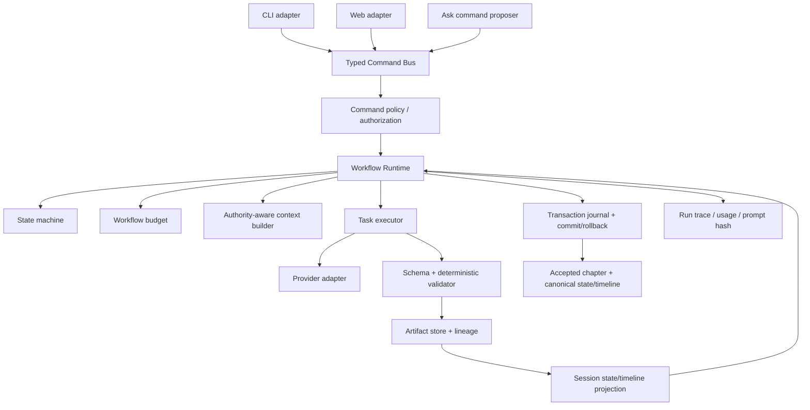

# Agent 系统优化方案与编码规划

> 制定日期：2026-07-11
>
> 依据：`docs/AGENT_SYSTEM_DESIGN_REVIEW_2026-07-11.md`
>
> 文档性质：目标架构、破坏性重构策略、编码任务、测试矩阵与验收标准。
> 本文只制定计划，不实施任何业务代码或配置修改。

> 实施进度（2026-07-11）：Strict Contracts、schema v3、migration 删除、Task Registry、Artifact Store/freshness、Creation Session projection、transaction journal、全 Session 原子 acceptance、artifact-aware Markdown/DOCX production export、独立 Segment Patch Workflow，以及阶段 5 的 Preview Package 已落地。Preview 固定写入 `exports/previews/` 且不修改 production manifest；Creation Session 的 `scope_type`、`segment_range` 和旧 `_run_segment_session` 已删除。阶段 6–9 的 Command Bus、Orchestrator/Budget、Context Authority、可观测性与锁改造尚未完成；本文后续章节仍作为目标规划。

## 一、规划结论

本轮优化不采用“在现有 Session 上继续增加条件分支”的方式，而采用一次明确的破坏性重构：

1. 保留四个模型 Profile 和现有专业 Task 的基本职责，不增加新的自治 Agent。
2. 用统一的 typed command、workflow state machine、artifact lineage 和 transaction runtime 替换当前分散的生命周期控制。
3. 把章节 Creation 与 Segment Revision 拆成两种不同 workflow，不再用一个 `scope_type` 同时承载两套语义。
4. 删除旧 schema 兼容、migration、旧命令别名、`.vN` 候选稿规则、未审计正式导出等旁路；不保留双轨实现。
5. 所有新工作区直接使用新 schema。旧 schema 工作区直接拒绝加载，不写转换器，不保留兼容读写分支。
6. CLI、Web 和自然语言 `ask` 只负责构造同一套 core command；业务判断不再落在 adapter 中。
7. 模型只负责有限、结构化的内容或决策任务；写权限、状态转换、范围控制、重试、成本和提交全部由 deterministic runtime 管理。

最终目标不是让 Agent 更自由，而是让每一次 Agent 调用都具备明确的输入版本、输出类型、权限范围、预算和可恢复状态。

## 二、明确不做历史兼容

### 2.1 Schema 策略

- 将项目 schema 直接升级为新主版本，例如 `schema_version = 3`。
- 删除 `src/novel/core/migration.py` 和公开的 migrate 命令。
- loader 只接受当前 schema；遇到旧版本时返回清晰的 `unsupported_project_schema` 错误。
- 不实现 v2 到 v3 的转换器，不保留 optional 旧字段，不在新模型中加入 deprecated alias。
- 测试 fixture、README 示例和初始化模板全部直接重建为新格式。

### 2.2 API 与 CLI 策略

- 直接删除 `include_unaccepted`、生产路径中的 `skip_audit` 以及旧 orchestration 参数。
- 不保留旧 endpoint 的转发 handler，不输出弃用警告，不维护双版本 OpenAPI/JSON payload。
- 删除公开的低层变更命令；Plot、Writer、Polish、Audit、State Update 仅作为 workflow 内部 node。
- 不保留 `polished.md`、`polished.v2.md`、`polished.v3.md` 的版本发现逻辑。

### 2.3 代码策略

- 新模块稳定后，立即删除被替代模块，而不是长期保留 `legacy_*`。
- 不允许新代码同时读取新旧 Session 状态字段。
- 不允许 `try new -> fallback old` 的文件发现逻辑。
- 破坏性变化只在 commit message 和 release notes 中声明。

## 三、重构后的系统不变量

以下不变量必须写成代码级 validator 和测试，而不是只写在 Prompt 或文档中。

### 3.1 Artifact 不变量

1. 每个正文 candidate 都有唯一 `artifact_id`、文件路径和 SHA-256。
2. Audit 必须绑定唯一 candidate 的 `artifact_id + sha256`。
3. State proposal 必须绑定 candidate、passed audit、base state 和 base timeline 的 hash。
4. Acceptance commit 必须绑定 candidate、audit、state proposal 和提交前后 state/timeline hash。
5. 任一上游 hash 不一致时，下游 artifact 动态判定为 stale。
6. 任何 stale artifact 都不能被 accept 或 production export。

### 3.2 Session 不变量

1. Creation Session 的章节按升序执行。
2. 第 N 章必须读取第 N-1 章更新后的 Session projection。
3. canonical state/timeline 在用户接受前不改变。
4. 接受前必须再次校验 Session 创建时的 base state/timeline 没有被其他操作改变。
5. Session commit 要么完整成功，要么可以通过 transaction journal 恢复到提交前状态。
6. 不允许外部只看到一个 `needs_user_review`，内部却已经有章节部分提交。

### 3.3 Segment Revision 不变量

1. Revision scope 必须绑定原始 accepted chapter 的 hash。
2. segment 使用连续 block range，不再使用含义不明的整数列表。
3. patch 应用后，目标范围外的正文 block 必须逐字节保持不变。
4. 合成 candidate 后必须重新 Audit 和重建 state proposal。
5. 用户最终接受的 candidate hash 必须与审阅页面显示的 hash 一致。

### 3.4 Agent 权限不变量

1. Plot 只能生成 plan candidate。
2. Writer 只能根据批准计划生成完整正文 candidate。
3. Polish 只能生成非结构性正文 candidate。
4. Revision 只能修改被授权 chapter/segment/issue。
5. Audit 只报告，不写正文、plan、canon、state 或 timeline。
6. State Update 只生成 delta，不能直接写 canonical state/timeline。
7. Canon 和 Memory Repair 只能生成 proposal；写入由 deterministic applier 完成。

### 3.5 导出不变量

1. Production Export 只接受存在有效 acceptance commit 的章节。
2. Export 时重新计算 accepted content hash，不信任 front matter。
3. Export manifest 记录每章 candidate、audit、acceptance commit 和 state commit hash。
4. 未接受或未审计内容只能生成 Preview Package，且输出元数据必须标记 `preview=true`。

## 四、目标架构



### 4.1 分层职责

| 层 | 只负责 | 不负责 |
|---|---|---|
| Adapter | 参数解析、认证/Origin、HTTP/CLI 序列化 | 业务路由、Session 同步、文件变更 |
| Command Bus | command 校验、handler 选择、统一错误 | 模型 Prompt、直接写 artifact |
| Policy | 权限、风险、确认、范围、预算预检 | 内容生成 |
| Workflow Runtime | node 顺序、状态转换、checkpoint、失败恢复 | Provider 细节 |
| Task Executor | 组装 Task 输入、调用 Provider、解析结构化输出 | 接受或导出决策 |
| Artifact Store | 原子写入、hash、引用、freshness | 业务路线选择 |
| Context Builder | 权威筛选、可见性、token budget、projection | 写 canonical memory |
| Transaction Runtime | commit journal、应用、回滚、恢复 | 模型调用 |

## 五、核心数据模型设计

### 5.1 拆分 `schemas.py`

将当前单体 `src/novel/core/schemas.py` 拆分为：

```text
src/novel/core/contracts/
  __init__.py
  common.py          # StrictModel、Hash、ArtifactId、时间等
  artifacts.py       # ArtifactRef、Lineage、ChapterLifecycle
  commands.py        # 所有 public command/result
  decisions.py       # Ask、Revision、Audit route
  sessions.py        # CreationSession、RevisionSession、transition
  state.py           # StateProposal、Projection、AcceptanceCommit
  tracing.py         # WorkflowRun、NodeRun、BudgetUsage
```

持久化内容模型仍可按领域留在原模块，但所有 inter-agent decision、command、transition 和 artifact 引用都继承：

```python
class StrictModel(BaseModel):
    model_config = ConfigDict(extra="forbid")
```

不再让控制面模型继承 `FlexibleModel`。确实需要自由 metadata 的地方显式使用 `dict[str, JsonValue]`。

### 5.2 Artifact 引用

建议的最小契约：

```python
class ArtifactRef(StrictModel):
    artifact_id: str
    kind: ArtifactKind
    path: str
    sha256: str
    created_at: datetime

class ArtifactLineage(StrictModel):
    output: ArtifactRef
    inputs: list[ArtifactRef]
    task_id: TaskId | None
    workflow_run_id: str
    prompt_hash: str | None
    policy_version: str
```

`ArtifactRef` 中的 hash 每次使用时重新验证。路径只允许 project-relative path，并通过 workspace path guard 防止目录逃逸。

### 5.3 Chapter 文件布局

直接替换现有 `plan.json`、`draft.md`、`polished.vN.md` 的“固定文件名即当前版本”规则：

```text
memory/chapters/001/
  lifecycle.json
  plans/
    plan_<artifact_id>.json
  candidates/
    candidate_<artifact_id>.md
  audits/
    audit_<artifact_id>.json
  state_proposals/
    state_<artifact_id>.json
  chapter_memories/
    memory_<artifact_id>.json
  accepted.md
  acceptance.json
  chapter_memory.json
```

说明：

- `plans/` 和 `candidates/` 中的 artifact 不覆盖，新的生成结果创建新文件。
- `chapter_memories/` 保存与 candidate 绑定的 pending memory；提交前不会覆盖当前 `chapter_memory.json`。
- `lifecycle.json` 记录 active plan/candidate 和所有 artifact refs，不复制正文内容。
- `accepted.md` 是当前接受版本的可读物化文件；`acceptance.json` 保存其应有 hash。
- transaction 成功后才把对应 pending memory 物化为当前 `chapter_memory.json`。
- 人工直接编辑 `accepted.md` 是允许的，但会使 acceptance stale；下一次 validation/export 明确要求重新 Audit 和接受。
- archive 只保存已被替换的 acceptance commit 和 artifact refs，不参与默认检索。

### 5.4 Audit 契约

`AuditReport` 改为：

```python
class AuditReport(StrictModel):
    audit_id: str
    chapter_number: int
    audited_artifact: ArtifactRef
    context_snapshot_hash: str
    policy_version: str
    overall_status: AuditStatus
    issues: list[AuditIssue]
    created_at: datetime
```

每个 `AuditIssue` 必须包含：

- 标准化 `category`；
- `severity`；
- `evidence`，引用 audited candidate 的 block/span；
- `confidence`；
- `auto_repair_eligible`；
- 可选 `suggested_fix`。

问题分类固定为：

- `consistency_violation`；
- `plan_deviation`；
- `clarity_risk`；
- `craft_suggestion`；
- `informational`。

只有前两类可进入自动修复；`clarity_risk` 和 `craft_suggestion` 默认交给用户。

### 5.5 State proposal 与 projection

```python
class WorldSnapshotRef(StrictModel):
    state: ArtifactRef
    timeline: ArtifactRef
    combined_sha256: str

class StateUpdateProposal(StrictModel):
    proposal_id: str
    chapter_number: int
    candidate: ArtifactRef
    audit: ArtifactRef
    base_snapshot: WorldSnapshotRef
    state_changes: list[StateChange]
    timeline_events: list[AnchoredTimelineEvent]
    created_at: datetime

class ProjectionCheckpoint(StrictModel):
    chapter_number: int
    proposal: ArtifactRef
    before_snapshot: WorldSnapshotRef
    after_snapshot: WorldSnapshotRef
```

`StateUpdateProposal` 中删除一切“靠文件名猜来源”的字段。proposal 生成后，deterministic applier 先应用到 Session projection；如果 old value、timeline monotonic 或 entity invariant 失败，当前章节不能进入 review-ready。

### 5.6 Acceptance commit

```python
class ChapterAcceptance(StrictModel):
    chapter_number: int
    candidate: ArtifactRef
    audit: ArtifactRef
    proposal: ArtifactRef
    chapter_memory: ArtifactRef

class AcceptanceCommit(StrictModel):
    commit_id: str
    session_id: str
    chapters: list[ChapterAcceptance]
    base_snapshot: WorldSnapshotRef
    final_snapshot: WorldSnapshotRef
    transaction_id: str
    committed_at: datetime
```

Acceptance commit 是“accepted”的唯一事实源。`polished.md` front matter 中的 `status` 不再参与权限判断。

## 六、Session 与状态机设计

### 6.1 拆成两类 workflow

#### Creation Workflow

用于创建一个或多个完整章节：

```text
DRAFTING_OUTLINE
  -> AWAITING_OUTLINE_APPROVAL
  -> READY_TO_RUN
  -> RUNNING
  -> AWAITING_CONTENT_REVIEW
  -> REVISING（可循环）
  -> READY_TO_COMMIT
  -> COMMITTING
  -> COMMITTED
  -> ARCHIVED
```

异常状态：

- `FAILED_RECOVERABLE`：存在有效 checkpoint，可 resume；
- `FAILED_TERMINAL`：输入或 invariant 已不可恢复；
- `CANCELLED`：在 node 边界安全停止；
- `RECOVERY_REQUIRED`：检测到未完成 transaction journal。

#### Revision Workflow

用于完整章节或 Segment 修改：

```text
SCOPE_PROPOSED
  -> SCOPE_CONFIRMED
  -> REVISING
  -> AUDITING
  -> AWAITING_REVIEW
  -> READY_TO_COMMIT
  -> COMMITTING
  -> COMMITTED
```

它不再复用 Creation Session 的 outline 状态字段。

### 6.2 单一状态字段

删除当前 `status + outline_status + content_status` 三套容易组合出非法状态的字段。新 Session 使用：

- 一个顶层 `phase`；
- `chapter_runs: dict[int, ChapterRunState]`；
- 已完成 node/checkpoint；
- 可执行的 `allowed_commands` 由 state machine 计算，不持久化猜测。

每个 transition 都有：

- `from_phase`；
- `command_type`；
- guard；
- side effects；
- `to_phase`；
- failure phase；
- 可恢复 checkpoint。

### 6.3 多章 projection 执行算法

1. Session start 时记录 canonical state/timeline 的 `base_snapshot`。
2. 创建 `memory/sessions/<session_id>/projection/state.json` 与 `timeline.json`。
3. Chapter 1 的 Plot、Writer、Audit 和 State Update 都读取 projection。
4. proposal 通过 deterministic validation 后应用到 projection，并写 checkpoint。
5. Chapter 2 使用 checkpoint 1 的 after snapshot；依次执行后续章节。
6. 任一章节失败时，保留前一个完整 checkpoint；resume 从失败 node 开始。
7. 用户 review 时看到每章 candidate、audit 和 projection delta。
8. accept 前重新计算 canonical base hash；若已变化，转为 `FAILED_RECOVERABLE`，要求重新生成/rebase，不做自动三方合并。
9. 全部验证通过后进入 transaction commit。

### 6.4 Transaction journal

采用“准备、应用、提交标记、清理”四阶段：

```text
PREPARED -> APPLYING -> COMMITTED
                    -> ROLLING_BACK -> ROLLED_BACK
```

Journal 记录：

- 所有目标路径；
- 写入前 hash；
- staging path；
- backup path；
- 写入后 hash；
- 已完成步骤；
- rollback 结果。

提交过程只做 deterministic 文件操作，不在锁内调用模型。Chapter Memory 等需要模型的 artifact 必须在 `PREPARED` 前以 `pending` 身份生成并验证；只有 Acceptance Commit 成功后才获得 `accepted/authoritative` 状态。

项目启动和任何写 command 执行前检查未结束 journal：

- 能证明所有 post-hash 已完成时补写 `COMMITTED`；
- 否则按 journal 自动 rollback；
- rollback 失败才进入 `RECOVERY_REQUIRED`，阻止新的写操作。

## 七、Segment Revision 重新设计

### 7.1 Scope Schema

删除 `segment_range: list[int]`，替换为：

```python
class SegmentSelection(StrictModel):
    chapter_number: int
    source_candidate: ArtifactRef
    start_block: int
    end_block: int
    selected_sha256: str
```

Markdown block parser 统一处理：

- front matter；
- heading；
- 普通段落；
- 引用；
- 列表；
- 分隔符。

UI 展示 block 编号和预览，用户确认后才创建 Revision Workflow。

### 7.2 Patch Schema

Revision Agent 不返回整章正文，返回：

```python
class SegmentPatch(StrictModel):
    source_sha256: str
    start_block: int
    end_block: int
    replacement_markdown: str
    addressed_issue_ids: list[str]
```

deterministic patch applier 验证：

- source hash 未变化；
- block range 与授权一致；
- replacement 不是空内容，除非命令明确允许删除；
- prefix/suffix hash 与原文相同；
- 合成结果能够被 Markdown/front matter parser 读取。

### 7.3 Candidate 与接受

Patch 合成新的完整 candidate。后续 Audit、State Proposal、Chapter Memory 和 Acceptance Commit 都绑定这个 candidate。旧 accepted chapter 在 commit 成功前保持不变。

## 八、Agent、Task 与 Prompt 优化

### 8.1 保留 Profile，重建 Task Registry

保留：

- `scribe`；
- `architect`；
- `loremaster`；
- `clerk`。

新增单一 `TaskSpec` registry：

```python
class TaskSpec(StrictModel):
    task_id: TaskId
    role_id: AgentRoleId
    profile_id: ProfileId
    output_contract: str
    readable_artifacts: set[ArtifactKind]
    writable_artifact: ArtifactKind
    context_policy_id: str
    prompt_policy_id: str
    default_budget: TaskBudget
    risk_level: RiskLevel
```

`agent_defaults.py` 只保留模型 Profile 默认值；Task 到 Profile、Prompt、Schema、权限和预算的映射迁入 `task_registry.py`。README 和 Web 配置说明由 registry 生成，杜绝职责表漂移。

### 8.2 调整 Task 边界

| Task | 保留/变化 |
|---|---|
| `plot` | 保留；输出 plan candidate，不写正式 plan |
| `writer` | 保留；只消费 approved plan ref |
| `polish` | 保留；只做非结构性候选稿 |
| `audit` | 保留；只审一个明确 candidate |
| `revision` | 保留；输出 scoped patch 或 full candidate，类型由调用模式固定 |
| `state_update` | 保留；输出绑定 snapshot 的 delta |
| `chapter_memory` | 保留；基于 commit-ready candidate、passed Audit 和 State Proposal 生成 pending artifact，只由 Acceptance Commit 激活为权威 memory |
| `canon` | 保留；proposal-first |
| `memory_repair` | 保留；配置独立预算和更严格 policy，不新增 Profile |
| `intent_router` | 改为 command proposer，不直接执行 |
| `setup` | 从 Agent 产品概念中移除，保留为 Provider connectivity 工具 |

### 8.3 Audit repair route

统一为具有真实 executor 的枚举：

- `replan`：Plot 生成新 plan，必须重新人工批准；
- `rewrite_from_plan`：Writer 按现有批准 plan 重写整章；
- `scoped_patch`：Revision 只修指定 issue/span；
- `manual_review`：停止自动流程。

删除当前名字不同但执行相同的 route。route validator 必须检查：

- `issue_ids` 是当前 Audit issue 子集；
- chapter 与 Audit 一致；
- `clarity_risk`/`craft_suggestion` 不能默认自动修；
- `replan` 不能跳过 outline approval；
- route 所需上下文完整。

### 8.4 Prompt Policy Registry

新增 `PromptPolicy`：

- human gate 由 runtime 传入，不在 Prompt 中写死；
- hidden truth 通过 `RevealAuthorization` 显式开放；
- workspace context 标注 `trust=untrusted_data`；
- user current command 与 workspace prose 使用不同字段；
- Prompt 声明本次允许写入的 artifact 类型和范围；
- Prompt version 同时记录语义版本和模板 hash。

修正现有冲突：

- 删除 Revision 每轮必须等待确认的静态句子；
- 删除 Revision 可自行改变核心情节的授权；
- Writer 没有 reveal authorization 时绝不获得 hidden truth；
- Audit 不再把 craft suggestion 提升为 consistency blocker；
- Audit 只接收一个 audited candidate；
- State Update 明确“无证据则不生成 change”。

## 九、统一 Command 与用户交互

### 9.1 Public Command 集合

标准产品入口只保留：

```text
project init / validate / status
session start / revise-outline / approve-outline / run / resume / cancel / review / revise / accept / archive
revision start / run / review / accept / cancel
memory repair-suggest / repair-apply
setting-change suggest / apply
export production
preview package
search
ask
```

删除公开的直接 `plan`、`write`、`polish`、`audit`、`state-update`、`generate-chapter` 变更路径。对应 Python Task 函数继续存在，但只能由 workflow runtime 调用。

### 9.2 Typed Command Bus

每个 command 都有 strict input/result，例如：

```python
class CommandEnvelope(StrictModel):
    command_id: str
    surface: Literal["cli", "web", "ask"]
    workflow_run_id: str
    command: Command
    confirmed: bool = False
```

handler 返回：

- `result`；
- `next_allowed_commands`；
- `warnings`；
- `workflow_run_id`；
- `changed_artifacts`；
- 可恢复信息。

统一 `DomainError`：

```python
class DomainError(Exception):
    code: str
    message: str
    recoverable: bool
    details: dict[str, JsonValue]
```

CLI 和 Web 只做相同错误对象的展示映射，从而解决 CLI traceback 和 Web/CLI 行为不一致。

### 9.3 Setting Change

把 `_sync_setting_change_session` 从 Web 删除。`ApplySettingChangeCommand` 的 core handler：

1. preflight memory repair；
2. 判断受影响 Session；
3. 生成明确 follow-up plan；
4. 用户确认后，在同一 workflow runtime 中应用；
5. 同步失败按 transaction policy 回滚或留下可恢复 checkpoint。

Web、CLI 和 ask 都调用同一个 handler。

### 9.4 Ask

Ask 不再直接返回模糊 task 后立即执行，而返回 strict `CommandProposal`：

```python
class CommandProposal(StrictModel):
    command: Command
    reason: str
    confidence: float
    risk: RiskLevel
    estimated_model_calls: int
    requires_confirmation: bool
    clarification_question: str | None
```

策略：

- status、show、search 等只读低风险命令可自动执行；
- 创建 Session、Revision、Memory Repair Suggest 等有成本动作先展示范围和预算；
- apply、accept、production export 必须显式确认；
- confidence 低于阈值或范围不明确时只澄清；
- 模型输出无效时 fallback 为 `unknown/clarify`，不再用 keyword classifier 猜测高风险动作；
- chapter range 有硬上限和项目范围校验。

## 十、Artifact-aware Export

### 10.1 Production Export

`collect_export_chapters` 改为调用 `LifecycleGuard.require_exportable(chapter)`：

1. 读取 acceptance commit；
2. 校验 accepted.md 当前 hash；
3. 校验 candidate/audit/proposal/chapter memory refs；
4. 校验 audit status passed；
5. 校验 state commit 包含该章；
6. 校验章节顺序和缺章策略；
7. 生成 export manifest。

任一失败都返回结构化 `not_exportable`，列出 stale edge，而不是仅跳过章节。

### 10.2 Preview Package

单独实现 `preview package`：

- 可以选 working candidate；
- 输出目录固定在 `exports/previews/`；
- 文档标题和 manifest 标记 Preview；
- 不写 production export manifest；
- 不允许被后续发布流程当作正式输出。

删除 `include_unaccepted`，不保留兼容参数。

## 十一、检索与上下文系统

### 11.1 SearchDocument 元数据

增加：

- `artifact_ref`；
- `authority`；
- `lifecycle_status`；
- `session_id`；
- `accepted_commit_id`；
- `visibility`；
- `source_sha256`。

### 11.2 删除全目录无差别索引

删除 `_markdown_documents` 对 `memory/**/*.md` 的全量 `rglob`，改为显式 collector：

- current canon；
- current canonical state/timeline；
- accepted chapters；
- fresh chapter memory；
- approved current plans；
- 当前 workflow 的 working candidate/projection，仅对该 workflow 开放。

默认排除：

- archive；
- rejection；
- backup；
- stale artifact；
- 其他 Session 的 candidate；
- transaction staging；
- model I/O logs。

需要历史资料时使用显式 `history_search` policy，不能靠相似度偶然进入创作上下文。

### 11.3 Authority 排序

固定优先级：

```text
canonical state/timeline/canon
> current approved plan
> current accepted chapter
> fresh chapter memory pointer
> current workflow candidate/projection
> explicit historical context
```

删除 archive 优先排序 bug。Search 只做召回，Context Policy 决定是否可进入 Prompt。

## 十二、Workflow 预算与可观测性

### 12.1 全局预算

```python
class WorkflowBudget(StrictModel):
    max_chapters: int
    max_model_calls: int
    max_provider_attempts: int
    max_auto_revision_rounds: int
    max_input_tokens: int | None
    max_output_tokens: int | None
```

所有 structured-output repair、Provider retry、audit recall、revision loop 都消耗同一个 workflow budget。Task 层不能绕过。

执行前做静态预估；执行中记录实际使用。预算不足时：

- 在安全 node 边界停止；
- Session 进入 `FAILED_RECOVERABLE` 或 `AWAITING_USER_DECISION`；
- 返回已完成 checkpoint 和增加预算后可 resume 的命令。

### 12.2 Trace 结构

```text
runs/<workflow_run_id>/
  run.json
  nodes/
    0001.json
    0002.json
  decisions/
    <decision_id>.json
```

每个 node 记录：

- `workflow_run_id`、`session_id`、`command_id`；
- `surface`、`parent_node_id`；
- Task/Profile/Provider/Model；
- input/output artifact refs；
- Prompt template hash、rendered prompt hash；
- retry/repair 次数；
- token/usage；
- 状态、异常和恢复建议。

删除 domain service 中硬编码 `caller="cli"`。Invocation context 从 adapter 一路传入 Provider。

### 12.3 隐私默认值

- 模型日志默认 `metadata`，而不是 full prose。
- 用户显式开启 full capture 时，在 UI/CLI 提示会保存正文和隐藏设定。
- full capture 仍使用 retention 和文件权限保护。
- 即使 metadata 模式也记录 Prompt/content hash，保证可追溯。

### 12.4 Project lock

锁记录增加：

- PID；
- process start time；
- host；
- workflow_run_id；
- heartbeat；
- command。

只有 PID 不存在、start time 不匹配或 heartbeat 超时才视为 stale。长任务持续刷新 heartbeat。

## 十三、计划新增、替换和删除的模块

### 13.1 新增

| 文件/目录 | 职责 |
|---|---|
| `src/novel/core/contracts/` | strict command、artifact、session、decision、trace Schema |
| `src/novel/core/task_registry.py` | Profile/Role/Task/Prompt/权限单一事实源 |
| `src/novel/core/artifact_store.py` | artifact 写入、hash、引用、freshness |
| `src/novel/core/lifecycle.py` | accept/export guard、stale edge 诊断 |
| `src/novel/core/workflow_runtime.py` | node executor、transition、resume、budget |
| `src/novel/core/creation_workflow.py` | Creation Session 定义 |
| `src/novel/core/revision_workflow.py` | Chapter/Segment Revision 定义 |
| `src/novel/core/projection.py` | Session-local state/timeline snapshot 和 delta 应用 |
| `src/novel/core/transactions.py` | journal、commit、rollback、crash recovery |
| `src/novel/core/command_bus.py` | typed public command dispatch |
| `src/novel/core/context_policy.py` | Task authority/visibility/injection policy |
| `src/novel/core/previewing.py` | Preview Package，与正式 export 分离 |

### 13.2 重写或大幅缩减

| 现有模块 | 处理方式 |
|---|---|
| `schemas.py` | 拆分；只保留纯领域内容模型或最终删除 |
| `session.py` | 被 Creation/Revision workflow 替换后删除 |
| `workflow.py` | 聚合逻辑迁入 runtime 后删除 |
| `orchestrator.py` | 删除 legacy plan/handoff/classifier，仅保留或迁移 decision proposer |
| `state_update.py` | 分为 proposal task、deterministic projection applier、commit handler |
| `exporting.py` | 只保留 production export，接入 lifecycle guard |
| `search.py` | 显式 collector + authority policy，移除全目录索引 |
| `prompts.py` | 只负责渲染；权限来自 Task/Prompt Policy registry |
| `agent_defaults.py` | 只保留 Profile provider defaults |
| `agent_output.py` | 改为统一 workflow trace context |
| `locking.py` | 增加 heartbeat 与 process identity |

### 13.3 删除

| 文件/能力 | 原因 |
|---|---|
| `migration.py` 及 migrate command/test | 明确不兼容旧 schema |
| `chapter_versions.py` | 用 immutable artifact ID 替代 `.vN` |
| `OrchestratorPlan`、`ALLOWED_HANDOFFS`、legacy `_execute_plan` | 没有真实多步执行语义 |
| keyword-only 高风险 classifier | fallback 只允许 unknown/clarify |
| `include_unaccepted` | Preview 独立建模 |
| 生产路径 `skip_audit` | 生命周期必须产生 audit；中途停止只能得到不可接受 candidate |
| 公开低层 mutation endpoint/command | 防止绕过统一 lifecycle |
| Web `_sync_setting_change_session` | 迁入 core command handler |
| `status + outline_status + content_status` 组合 | 替换为单一 phase + node state |

## 十四、分阶段编码计划

阶段按依赖顺序排列。每个阶段完成后必须通过新增单元测试和现有适用测试；不允许把全部测试留到最后补。

### 阶段 0：冻结新契约和破坏性边界

目标：先把新系统的事实源写成代码契约，避免后续模块各自理解。

任务：

- P0.1 建立 `contracts/` 和 `StrictModel`。
- P0.2 定义 `ArtifactRef`、`WorldSnapshotRef`、`Command`、`SessionPhase`、`WorkflowBudget`。
- P0.3 定义 Task/Profile/Role/Artifact 枚举和 registry。
- P0.4 设置新 schema version；loader 拒绝旧版本。
- P0.5 删除 migration command/module/tests。
- P0.6 更新 workspace initializer 和全部 fixture。

验收：

- 所有控制面模型 `extra="forbid"`；
- v2 workspace 明确拒绝，无迁移代码路径；
- registry 能生成 Task 到 Profile/Prompt/Schema/权限表；
- 新工作区能初始化并通过 validation。

### 阶段 1：Artifact Store 与 freshness

目标：先建立后续所有修复依赖的版本血缘。

任务：

- P1.1 实现 project-relative path guard 和 SHA-256 helper。
- P1.2 实现 immutable artifact create/read/verify。
- P1.3 实现 chapter `lifecycle.json`。
- P1.4 改造 Plan、Writer、Polish、Audit、State Update 输出为 `ArtifactRef`。
- P1.5 实现 `LifecycleGuard` 的 audit/proposal/accept/export freshness 检查。
- P1.6 删除 `chapter_versions.py` 和 `.vN` 生成逻辑。
- P1.7 人工修改 artifact 后提供 stale edge 诊断。

验收：

- 修改 candidate 一个字符会让 Audit stale；
- 替换 Audit 会让 State Proposal stale；
- 修改 canonical state 会让未提交 Session base snapshot stale；
- 所有 stale 错误返回具体依赖边，不只返回布尔值。

### 阶段 2：Creation Workflow 与 projected state

目标：重建单章和多章统一流程。

任务：

- P2.1 实现单一 Session phase 和 transition table。
- P2.2 实现 Creation Workflow node 定义。
- P2.3 实现 state/timeline projection 和 checkpoint。
- P2.4 让每个后续章节读取上一章 projection。
- P2.5 实现 node 级 resume/cancel。
- P2.6 失败时写入 `FAILED_RECOVERABLE` 和准确 checkpoint。
- P2.7 删除旧 `session.py` 中对应流程和 `workflow.py` 聚合路径。

验收：

- 两章以上 Session 的第二章 Prompt context 含第一章 projected change；
- 第二章 proposal 的 base hash 等于第一章 checkpoint after hash；
- 任一 node 失败后可从该 node resume，不覆盖已完成 artifact；
- canonical state/timeline 在 accept 前不变化。

### 阶段 3：Transaction Acceptance

目标：消除部分提交。

任务：

- P3.1 实现 transaction staging 和 journal。
- P3.2 在 PREPARED 前生成/验证 pending Chapter Memory，commit 成功后再激活其权威状态。
- P3.3 实现整 Session preflight。
- P3.4 实现 accepted chapter、state、timeline、acceptance commit 的组合提交。
- P3.5 实现故障注入 rollback。
- P3.6 实现启动时 crash recovery。
- P3.7 移除 `accept_chapter` 中按文件存在猜测已应用的逻辑。

验收：

- 第二章写入故障时，第一章、state、timeline 和 metadata 全部回到提交前 hash；
- 进程在每一个 journal step 中断后都能自动恢复；
- 成功提交后 acceptance refs 全部 fresh；
- 不再存在 durable `partially_applied` 正常状态。

### 阶段 4：Segment Revision Workflow

目标：保证范围、审阅对象和提交对象一致。

任务：

- P4.1 实现 Markdown block parser 和稳定 selection hash。
- P4.2 实现 `SegmentSelection`、`SegmentPatch` validator。
- P4.3 Revision Task 输出 patch，不输出整章。
- P4.4 deterministic 合成 candidate 并验证范围外 hash。
- P4.5 对新 candidate 运行 Audit、State Proposal，并生成 pending Chapter Memory。
- P4.6 用同一 transaction acceptance 提交。
- P4.7 删除 `segment_range` 和 `_run_segment_session` 旧实现。

验收：

- 目标 block 外任何变化都会拒绝 patch；
- source hash 改变后 patch 不能应用；
- review payload、Audit、State Proposal、Acceptance Commit 的 candidate hash 完全相同；
- Segment commit 失败时旧 accepted chapter 保持不变。

### 阶段 5：正式导出与 Preview 分离

目标：关闭最后一个 lifecycle 绕过。

任务：

- P5.1 Production Export 接入 `LifecycleGuard`。
- P5.2 Export manifest 增加 lineage refs。
- P5.3 新增 Preview Package service。
- P5.4 删除 `include_unaccepted` 和相关 CLI/Web/UI/tests。
- P5.5 删除生产路径 `skip_audit`；中途停止只生成 working candidate。

验收：

- 没有 passed fresh Audit 时 production export 必须失败；
- accepted.md 被人工修改后必须失败；
- Preview 输出不能更新 production manifest；
- Markdown 和 DOCX 使用同一章节 eligibility 结果。

### 阶段 6：统一 Command Bus 和 Adapter

目标：让 CLI、Web、ask 真正共享业务逻辑。

任务：

- P6.1 实现 command envelope、handler registry 和 `DomainError`。
- P6.2 CLI 只构造 command 和格式化 result。
- P6.3 Web 只构造 command 和返回统一 envelope。
- P6.4 Setting Change follow-up 迁入 core。
- P6.5 删除公开低层 mutation commands/endpoints。
- P6.6 更新 Web UI 的 allowed actions，使按钮来自 core result。

验收：

- CLI/Web 对相同 command fixture 的 domain result 深度相等；
- Session/State 错误不再输出未捕获 traceback；
- Web adapter 不导入 Plot/Writer/Revision/State Update service；
- adapter 内没有 Session 状态分支。

### 阶段 7：替换 Orchestrator 与全局预算

目标：让“multi-agent workflow”具有真实运行语义。

任务：

- P7.1 实现静态 workflow definitions 和 node executor。
- P7.2 每个 Agent 调用通过 Task Registry 和 Budget Ledger。
- P7.3 structured repair、Provider retry、audit recall 全部计入预算。
- P7.4 Ask 改为 command proposer。
- P7.5 实现 low-confidence clarify 和范围/cost guard。
- P7.6 删除 legacy graph、handoff trace 和 keyword classifier。

验收：

- `max_model_calls` 能限制完整多章 Session；
- 所有 retry 都出现在同一个 run usage 中；
- 低置信度写操作不会直接执行；
- 任意 workflow node 都能追溯 parent、input refs 和 output refs。

### 阶段 8：Context Authority 与 Prompt Policy

目标：降低旧内容污染和 Prompt 策略漂移。

任务：

- P8.1 Search collector 改为 allowlist。
- P8.2 实现 authority/lifecycle/visibility metadata。
- P8.3 按 Task 应用 Context Policy。
- P8.4 引入 untrusted workspace data delimiter。
- P8.5 引入 Reveal Authorization。
- P8.6 统一 Audit 分类和自动修复政策。
- P8.7 Prompt registry 记录 template/policy hash。
- P8.8 修正所有 Prompt 冲突并新增策略一致性测试。

验收：

- archive/rejection/backup/stale 默认召回为零；
- Writer 无 reveal authorization 时看不到 hidden truth；
- Audit 只收到一个 audited candidate；
- workspace 中的伪指令不会改变 route 或权限；
- README Profile 表由 registry 生成且与运行时相同。

### 阶段 9：可观测性、隐私、锁与类型严格度

目标：完成生产前的运维基础。

任务：

- P9.1 统一 run/node/decision trace。
- P9.2 传播 surface/session/parent request。
- P9.3 模型日志默认 metadata，full capture 显式开启。
- P9.4 Project lock 增加 heartbeat 和 process identity。
- P9.5 对 `contracts/`、workflow、artifact、transaction 开启 strict mypy。
- P9.6 删除已无引用的旧 helper、Prompt、Schema 和测试。
- P9.7 更新全部中文架构和用户文档。

验收：

- 一次用户操作可完整查询全部 node、调用、重试和 artifact；
- 无硬编码 `caller="cli"`；
- 长任务不会因纯时间阈值被误判 stale；
- 新核心模块 strict mypy 通过；
- `rg` 不再发现 legacy class/flag/path。

## 十五、测试规划

### 15.1 单元测试

| 测试文件 | 覆盖 |
|---|---|
| `tests/test_artifact_store.py` | hash、path guard、immutable write、freshness |
| `tests/test_lifecycle.py` | audit/proposal/accept/export guard |
| `tests/test_session_state_machine.py` | 每个合法/非法 transition |
| `tests/test_projection.py` | 多章 delta、old value、timeline monotonic |
| `tests/test_transactions.py` | 每个 journal step 的 commit/rollback/recovery |
| `tests/test_revision_workflow.py` | segment selection、patch、范围外不变 |
| `tests/test_command_bus.py` | strict command、handler、DomainError |
| `tests/test_task_registry.py` | Task/Profile/Prompt/权限单一映射 |
| `tests/test_context_policy.py` | authority、visibility、stale、history mode |
| `tests/test_workflow_budget.py` | retry/repair/recall 的全局计数 |
| `tests/test_prompt_policy.py` | Prompt 与 runtime 权限一致 |

### 15.2 集成测试

必须覆盖：

1. 单章 Creation：start 到 production export。
2. 三章 Creation：projection 连续、一次 transaction commit。
3. 三章中第二章生成失败：resume 后完成。
4. 三章 accept 中途 I/O 故障：全回滚。
5. canonical state 在 review 期间变化：accept 拒绝并给出 rebase 诊断。
6. Segment Revision：目标范围修改、重新审计、接受和导出。
7. accepted.md 人工编辑：stale、拒绝导出、重新审计后恢复。
8. Setting Change：CLI/Web 结果一致，失败可恢复。
9. Ask 低置信度：只澄清，不创建 Session。
10. Ask 大范围：预算预检拒绝。
11. archive/rejected 文本包含高相似关键词：不进入默认 ContextBundle。
12. Prompt injection fixture：伪指令不改变 route。

### 15.3 Adapter contract 测试

为每个 public command 使用同一 fixture 分别调用：

- core handler；
- CLI JSON mode；
- Web API。

比较规范化后的 result、错误 code、allowed commands 和 changed artifact refs。展示文案可以不同，domain payload 必须相同。

### 15.4 Web E2E

至少覆盖：

- 多章进度和 projection 摘要；
- review 页面显示 candidate hash；
- Segment block 选择与范围预览；
- stale 状态的明确提示；
- transaction recovery 提示；
- Production Export 与 Preview 按钮分离；
- 高风险 ask confirmation。

### 15.5 回归门槛

每个阶段执行：

```text
ruff check
mypy（先核心 strict target，最后扩展）
pytest -m "not real_api and not web_e2e"
pytest -m web_e2e
python -m build
secret scan
```

真实 API 测试作为最终 smoke test，不用于替代 deterministic mock 测试。

## 十六、建议 Commit 序列

以下序列强调每笔 commit 只有一个架构目的。commit 信息使用英文，并用 `!` 标记破坏性变化。

1. `refactor!: replace legacy schemas with strict workflow contracts`
2. `refactor!: drop project migrations and rebuild workspace schema`
3. `feat: add artifact lineage and lifecycle guards`
4. `refactor!: replace numbered chapter versions with immutable candidates`
5. `feat: add session world-state projections and checkpoints`
6. `refactor!: replace creation sessions with a typed state machine`
7. `feat: commit accepted sessions with recoverable transactions`
8. `refactor!: rebuild segment revision as scoped patch workflow`
9. `refactor!: separate preview packages from production exports`
10. `refactor!: unify CLI and web mutations behind typed commands`
11. `refactor!: replace legacy orchestrator with workflow runtime`
12. `feat: enforce workflow-wide budgets and invocation tracing`
13. `feat: enforce authoritative context retrieval policies`
14. `refactor: align prompts with task and audit policies`
15. `feat: add lock heartbeats and metadata-first model logging`
16. `docs: rewrite architecture and workflow documentation`

每笔 commit 完成后按项目要求更新本地 `.agents/commit_push_log.md`；全部验证通过后再 push。不要为了让中间 commit 兼容旧 schema 而添加临时 adapter。

## 十七、依赖关系与并行限制

### 17.1 强依赖

```text
Strict Contracts
  -> Artifact Lineage
    -> Projection
      -> Transaction Acceptance
        -> Segment Revision
        -> Production Export

Strict Contracts
  -> Command Bus
    -> Workflow Runtime / Budget
      -> Ask

Artifact Lineage + Task Registry
  -> Context Policy
    -> Prompt Policy
```

### 17.2 可以并行的工作

在 Contracts 稳定后，可以并行：

- Artifact Store 单元测试与 Task Registry；
- Transaction failure harness 与 Segment block parser；
- CLI/Web adapter contract fixture 与 Prompt Policy 设计；
- Context collector 与 trace UI 展示。

### 17.3 不应并行的工作

- 不应在 ArtifactRef 未定型时同时重写 Audit、State Proposal 和 Export。
- 不应在 Session phase 未定型时同时修改 CLI、Web 和 UI 状态按钮。
- 不应先修旧 Segment Session 再实现新 Revision Workflow；旧实现会被删除。
- 不应为通过旧测试保留旧字段或命令；应改写测试表达新不变量。

## 十八、风险控制

### 18.1 重构范围过大

控制方式：按上述 commit 序列切分；每个阶段保持新 schema 下的测试可运行。允许删除旧功能后再加入新功能，但不允许新旧两套 runtime 长期并存。

### 18.2 Transaction 实现复杂

控制方式：先实现纯文件 transaction harness，使用故障注入覆盖每一个 step，再接入 Session。模型调用全部放在 PREPARED 前，缩小事务范围。

### 18.3 Artifact 数量增加

控制方式：artifact 不覆盖但可在 Session archive 后运行显式 garbage collection。GC 只能删除没有被 lifecycle、acceptance、export 或 run trace 引用的 artifact，并必须支持 dry-run。GC 不属于第一批 P0 实现。

### 18.4 Prompt 与策略再次漂移

控制方式：Task/Prompt Policy registry 是单一事实源；Prompt 测试比较 policy 字段和渲染结果，不再只搜索固定短语。

### 18.5 用户直接编辑文件

控制方式：继续允许编辑 Markdown/JSON，但所有关键使用点重新算 hash。人工编辑不是错误；它只会明确让相关下游 artifact 变 stale，要求重新走必要步骤。

## 十九、完成定义

整个优化计划完成时，必须同时满足：

1. 仓库中不存在旧 schema migration 或双读写兼容代码。
2. 不存在 `.vN` candidate、`include_unaccepted`、生产 `skip_audit` 和 legacy orchestration graph。
3. CLI/Web/ask 的所有写操作都经过 typed command bus。
4. Creation 与 Revision 是独立 typed workflow。
5. 多章生成使用 persisted projection，后续章节读取前序 delta。
6. Session 接受具备 journal、rollback 和 crash recovery。
7. Segment 修改范围可证明，review hash 等于 accepted hash。
8. Audit、State Proposal、Acceptance、Export 具有完整 artifact lineage。
9. Production Export 无法导出 stale、未审计或未提交章节。
10. Search 默认只使用当前权威、fresh artifact。
11. Agent 的读写权限由 Task Registry 和 runtime 强制，不依赖 Prompt 自觉。
12. Workflow budget 覆盖全部 Agent 调用、retry 和 repair。
13. 任一用户操作可以从 run trace 还原完整决策和 artifact 链。
14. 所有 state transition、transaction failure 和关键跨入口行为都有测试。
15. 离线测试、Web E2E、lint、strict core type check、build 和 secret scan 全部通过。

## 二十、推荐的实际开工顺序

第一轮开发只处理四件事：

1. Strict Contracts；
2. Artifact Lineage；
3. Multi-chapter Projection；
4. Transaction Acceptance。

这四项完成前，不扩展 Ask、不优化 UI、不新增 Agent，也不做历史资料高级检索。它们直接解决报告中的 P0-1、P0-3 和大部分 P0-4，并为 Segment Revision 提供正确基础。

第二轮完成 Segment Revision、Production/Preview Export 和 Command Bus，关闭剩余 P0 与入口旁路。

第三轮再替换 Orchestrator、收紧 Context/Prompt Policy、补齐全局预算和可观测性。

这样的顺序能避免在错误的生命周期基础上继续打磨路由和 UI，也避免为了旧 schema、旧命令或旧文件布局制造过渡性冗余代码。
