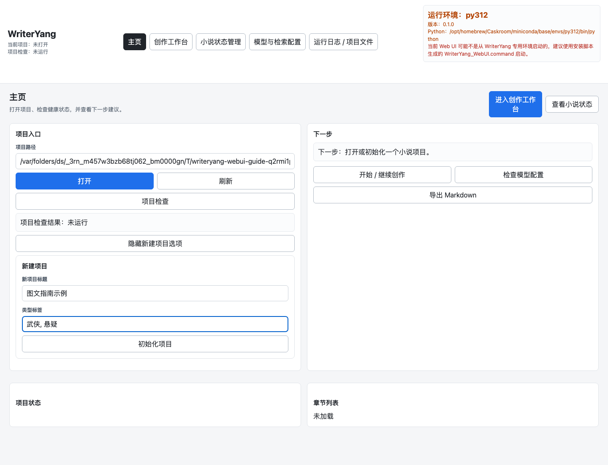
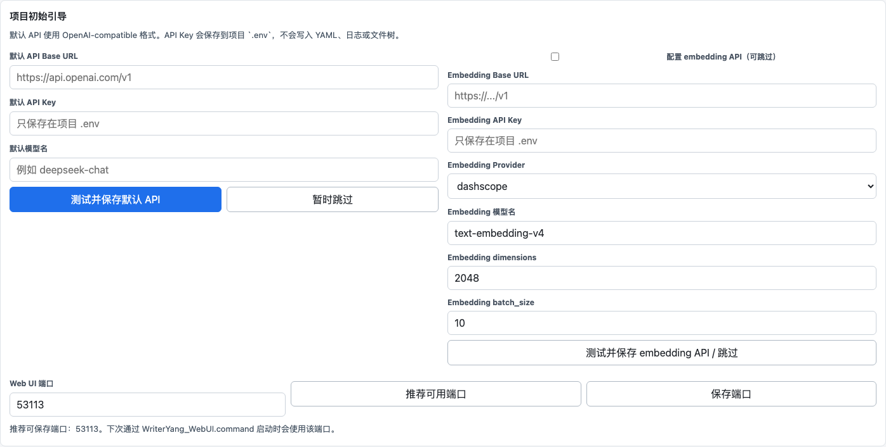
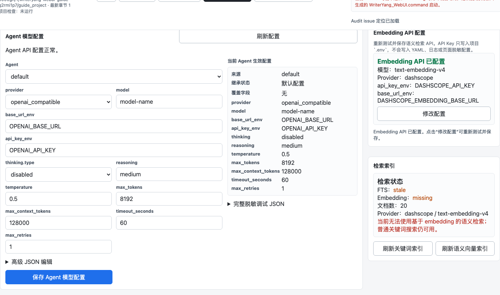
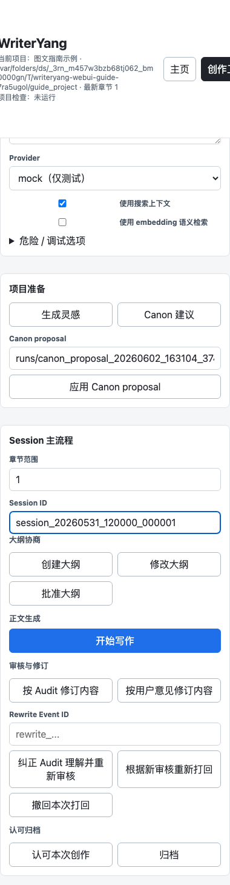
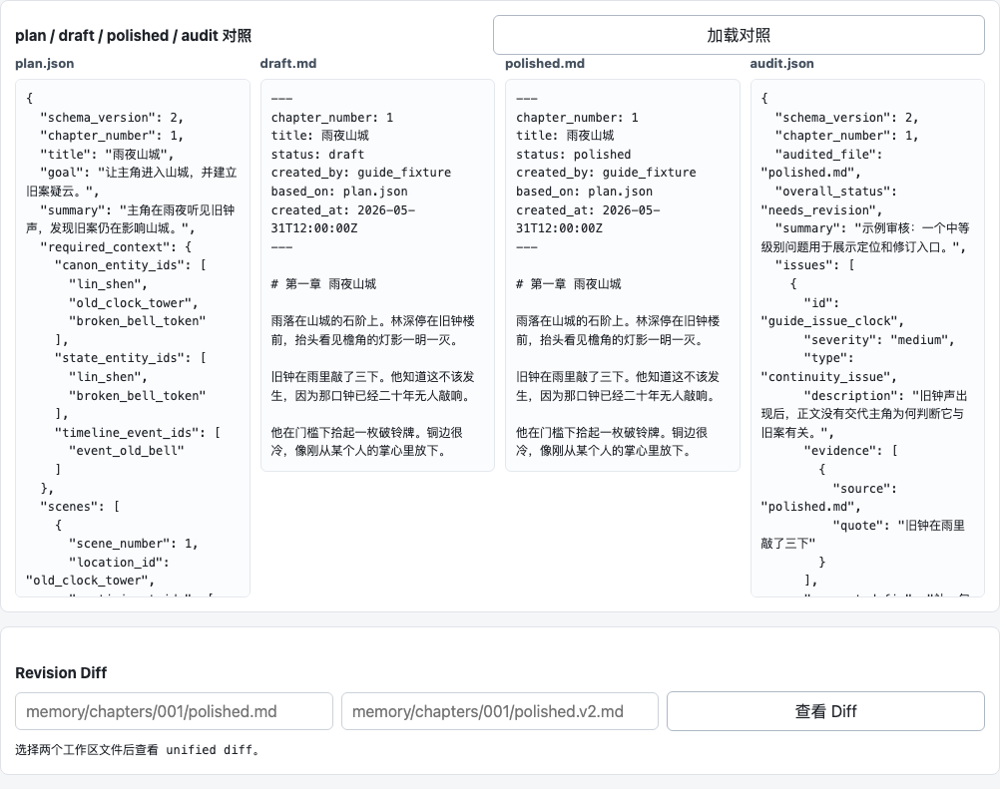
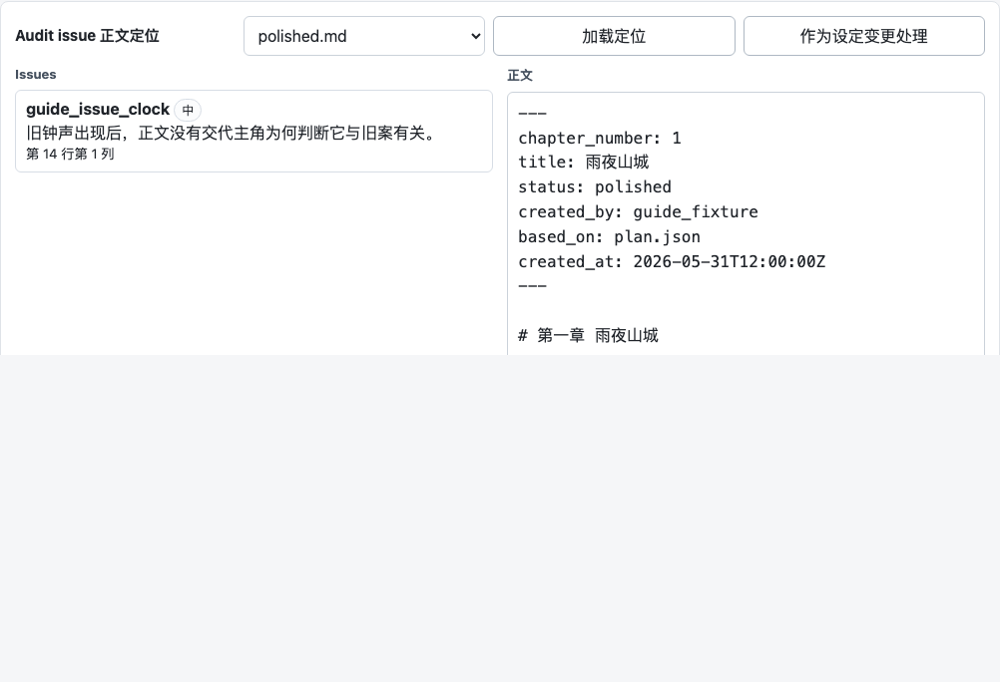
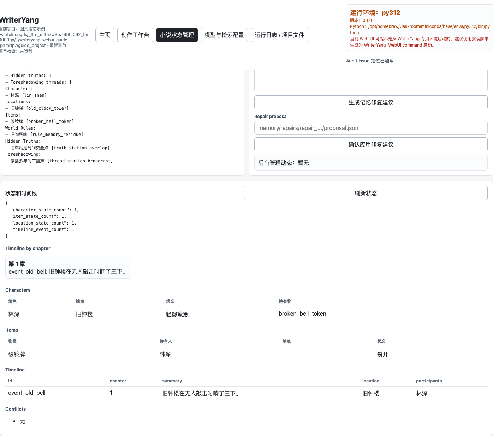
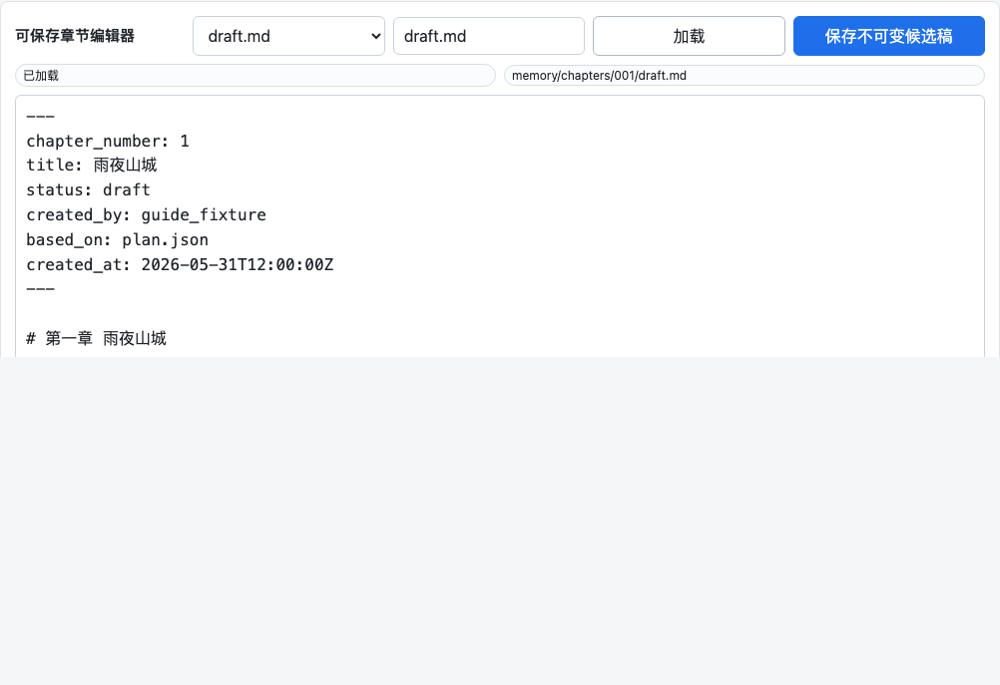
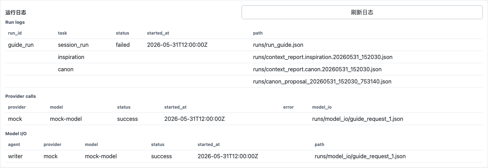

# Web UI 小白使用指南

这篇文档面向不懂代码、不熟悉命令行的作者。你可以把 WriterYang 理解为一个本地作者工作台：它不会替你独自完成一部长篇小说，而是和你协作，理解你的创作意图，帮你整理设定、生成大纲、写初稿、润色、审核逻辑，并把你认可的内容归档下来。

## 你需要先知道的三件事

1. WriterYang 的核心入口是“本次创作 Session”。一次 Session 可以是一章、几章，或某一章中的一段创作任务。
2. 大纲必须先由你认可。只有你批准大纲后，系统才会开始写作、润色和审核。
3. 归档后的内容默认不可直接篡改。如果你后来想改已经认可的内容，应创建新的修订任务，而不是覆盖旧归档。

## 打开 Web UI

如果别人已经帮你安装好工具，只需要让对方启动本地 Web UI，然后在浏览器打开类似下面的地址：

```text
http://127.0.0.1:8765
```

如果端口被占用，启动者会看到明确提示，并可以换一个端口。Web 页面打开后，左上角会看到“项目路径”。



## 第一次创建小说项目

1. 在“新项目父目录”输入一个本地文件夹路径，例如 `myNovel` 或 `/Users/yang/Novels`。Web UI 会在这个父目录下按书名创建项目子目录。
2. 在“新项目标题”输入书名。比如父目录是 `/Users/yang/Novels`、书名是 `雨夜旧车站`，最终项目目录就是 `/Users/yang/Novels/雨夜旧车站`。
3. 在“类型标签”输入题材，例如：`武侠, 悬疑`。
4. 确认“最终项目目录”预览无误后，点击“初始化项目”。
5. 页面会把左上角“项目路径”自动切换到最终项目目录，并显示“项目初始引导”。按顺序完成默认 API、可选 embedding、下次启动器端口设置。
6. 点击“项目检查”。按钮下方的“项目检查结果”会显示错误数和警告数；如果显示 `0 个错误`，就可以继续。



项目初始化后，工具会创建 `memory/`、`config/`、`chapters/`、`runs/`、`exports/` 等目录。你不需要手动理解这些目录；Web UI 会帮你查看和操作。

打开已有项目或初始化成功后，“新建项目”区域会自动收起，避免误点“初始化项目”。如果你需要再创建另一个项目，在主页点击“显示新建项目选项”即可重新展开。

## 项目初始引导和模型配置

初始化项目后，Web UI 会显示“项目初始引导”。这一步只需要做一次。

1. 在“默认 API Base URL”输入你的模型服务地址。它必须兼容 OpenAI Chat Completions 格式，例如以 `/v1` 结尾的兼容接口地址。
2. 在“默认 API Key”输入密钥。输入框会隐藏内容，密钥只保存到项目根目录 `.env`。
3. 在“默认模型名”输入模型名，例如你的服务商提供的 chat 模型名称。
4. 点击“测试并保存默认 API”。工具会先做一次最小连通性测试，成功后才把这组配置设为所有 Agent 的默认 API。
5. 如需语义检索，勾选“配置 embedding API”，填写 embedding base URL、API Key 和模型名，再点击“测试并保存 embedding API / 跳过”。如果暂时不配置，关键词检索仍可用。
6. 点击“推荐可用端口”或手动输入端口，再点击“保存端口”。保存前会验证端口是否可用；保存成功后，下次双击 `WriterYang_WebUI.command` 会使用这个端口启动。

真实 API Key 会写入项目 `.env`，不会写进 `config/agents.yaml`、日志、文件树或导出文件。`config/agents.yaml` 只保存环境变量名、模型名和调用参数。初始引导完成后，这组 API 会作为 default；所有勾选“继承default”的 Agent 会继承 default 调用参数，并保留各自的 `temperature`、`thinking.type`、`reasoning` 业务设置。

以后如果你想单独调整某个 Agent，可以打开“模型与检索配置”页里的“Agent 模型配置”。勾选“继承default”时，`provider`、`model`、`base_url_env`、`api_key_env`、`json_response_format`、`max_tokens`、`max_context_tokens`、`timeout_seconds`、`max_retries` 等调用字段会跟随 default 并锁定，`temperature`、`thinking.type`、`reasoning` 仍可编辑为 Agent 业务 patch。如果要单独切换 provider/model/token/timeout，取消勾选“继承default”，页面会把当前生效配置填入表单并保存为独立完整配置。如果当前 provider 不会发送某个参数，页面会显示 `NA` 并禁用该字段，例如 OpenAI-compatible 不发送 `thinking.type`，DeepSeek 开启 thinking 后不发送 `temperature`。右侧“当前 Agent 生效配置”会显示最终使用的是 default + 业务 patch 还是独立 Agent 配置；完整脱敏 JSON 只放在调试折叠区。不要把真实 API Key 写进配置页。



## Provider 选项

Web UI 的 Provider 下拉框有两个常用选项：

- `config`：使用项目里的模型配置，适合真实创作。
- `mock`：离线测试用，不调用真实模型，只适合熟悉流程或排查问题。

真实项目需要在 `config/agents.yaml` 配置顶层 `default` API；没有单独配置 API 的 Agent 会自动继承这个缺省配置。默认情况下，初始引导会帮你完成这一步。如果 Web UI 标红提示“default API config is missing”或环境变量不存在，说明项目还没有配置缺省 API，只能做 mock 测试，不能稳定进行真实创作。

“模型与检索配置”页可以在项目初始化后重新配置 embedding API。填写新的 Embedding Base URL、API Key、provider、模型名、`dimensions` 和 `batch_size` 后点击“测试并保存 embedding API”，工具会先用当前批量和维度做连通性测试，成功后把 API Key 写入项目 `.env`、把模型名和参数等非密钥配置写入 `config/embeddings.yaml`，清空输入框，随后自动刷新语义向量索引。DashScope `text-embedding-v4` 默认使用 `dimensions: 2048` 和 `batch_size: 10`。关键词检索是默认可用能力；如果 embedding API 没有配置好，页面会用红色提示“当前无法使用基于 embedding 的语义检索；普通关键词搜索仍可用”。工具只会在三种情况下调用外部 embedding API：你保存 embedding API 后的自动刷新、你明确点击“刷新语义向量索引”，或你启用“使用 embedding 语义检索”且当前语义向量缺失或过期。未启用 embedding 的普通关键词/FTS 检索不会调用外部 embedding API。

如果页面弹出或标红提示“Web UI 后台版本不匹配”，说明浏览器里的前端文件和正在运行的后台接口不是同一版本，常见原因是更新代码后没有重启 Web UI 后台。请停止旧后台，按项目的 Web UI 启动命令重新启动后台，再刷新页面；前端不会用旧接口响应猜测 Agent 或 embedding 的配置状态。

## Web UI 界面元素速查

页面顶部是主导航，分为“主页”“创作工作台”“小说状态管理”“模型与检索配置”“运行日志 / 项目文件”。多数长任务会显示已用时和最近操作；真实 API 写作、审核和索引可能需要等待。Session 写作期间，“取消当前 Session 任务”和刷新类按钮仍可用。

### 顶部主导航

顶部导航负责切换不同工作区域。切换页面不会清空项目路径、Session ID、章节号或聊天 / 指令内容。



| 页面 | 用途 | 使用方法 |
| --- | --- | --- |
| 主页 | 打开/初始化项目、项目检查、查看项目摘要和下一步提示。 | 新用户先在这里打开项目；每次手动编辑 memory 后点“项目检查”。 |
| 创作工作台 | 日常创作入口。 | 填章节范围和聊天 / 指令，创建大纲、修改大纲、批准大纲、开始写作、按 Audit 修订内容、认可归档。 |
| 小说状态管理 | 管理人物、物品、地点、背景、隐藏背景、伏笔、状态和时间线。 | 查看“状态 / 时间线”，或用项目管家生成记忆修复 proposal。 |
| 模型与检索配置 | 管理 Agent 模型配置、embedding 配置和搜索索引。 | 检查 default API、编辑各 Agent 参数、刷新关键词索引或刷新语义向量索引。 |
| 运行日志 / 项目文件 | 调试和排查问题。 | 查看安全文件树、只读预览、运行日志、provider calls 和 model I/O 摘要。 |

### 主页

主页只保留项目入口和最关键的状态。

| 元素 | 用途 | 使用方法 |
| --- | --- | --- |
| 项目路径 / 打开 / 刷新 | 读取或重新读取当前项目。 | 这里用于打开已有项目；新建项目成功后会自动填入最终项目目录。切换项目后建议先点“项目检查”。 |
| 项目检查 | 运行 validation。 | 结果会显示在“项目检查结果”；完整 JSON 详情会写入“运行日志 / 项目文件”的“章节文件查看”。 |
| 显示新建项目选项 / 隐藏新建项目选项 | 展开或收起新建项目区域。 | 打开已有项目后会自动收起；需要再创建新项目时手动展开。 |
| 新项目父目录 / 新项目标题 / 类型标签 / 初始化项目 | 创建新小说项目。 | 只在“新建项目”区域展开时显示；填父目录、标题和题材，确认最终项目目录预览后点“初始化项目”。 |
| 项目初始引导 | 配置默认 API、可选 embedding 和下次启动器端口。 | 初始化后自动出现；依次测试并保存默认 API、embedding、启动器端口。 |
| 下一步 | 显示当前推荐操作。 | 根据项目检查和 Session 状态提示批准大纲、开始写作、修订或归档。 |
| 导出 Markdown / DOCX | 导出 accepted 章节。 | 默认只导出已认可章节；可填写章节列表、章节范围、标题、输出路径，也可勾选包含未认可章节或覆盖已有文件。 |

### 创作工作台

创作工作台是普通作者最常用的页面。



| 区域 | 用途 | 使用方法 |
| --- | --- | --- |
| 创作输入 | 设置章节号、聊天 / 指令、Provider、搜索上下文。 | 真实创作默认选 `config`；`mock` 只用于测试。 |
| 使用搜索上下文 | 让各 Agent 加入可解释检索上下文。 | 默认使用结构化实体扩展 + 关键词/FTS，不调用 embedding API。 |
| 使用 embedding 语义检索 | 在搜索上下文中加入向量召回。 | 需要先配置真实 embedding API；启用后如向量缺失或过期，工具会自动刷新并调用外部 embedding API。 |
| 危险 / 调试选项 | 显示 force 和底层单章命令。 | 普通创作不要频繁使用；高级用户排查问题时可运行“生成计划 / 写章节 / 润色 / 审核”。 |
| 项目准备 | 生成灵感、Canon 建议和应用 Canon proposal。 | 先生成灵感，再 Canon 建议，确认 proposal 后应用。 |
| Session 主流程 | 大纲协商、正文生成、审核修订、认可归档。 | 推荐顺序是“创建大纲 -> 修改大纲 -> 批准大纲 -> 开始写作 -> 按 Audit 修订内容 -> 认可本次创作 -> 归档”。 |
| Rewrite Event ID | 自动打回记录编号。 | 在“自动打回重写记录”里点“选择该打回记录”自动填入。 |
| 纠正 Audit 理解并重新审核 | 与 Audit Agent 复审。 | 当你认为审核误判时，在“聊天 / 指令”说明原因后点击。 |
| 根据新审核重新打回 / 撤回本次打回 | 控制自动打回后的修订流程。 | 复审后可重新打回；如果打回不合理，可恢复被打回原文快照。 |
| Session 面板 / 自动打回重写记录 / 被打回原文 | 展示 Session 状态、打回证据和原文快照。 | 遇到 `needs_revision` 时先看这些区域，不要重复创建新 Session 覆盖产物。 |
| 当前任务进度 / 取消当前 Session 任务 | 显示长任务阶段、章节、轮次、已用时和最近事件。 | 只有 Session 写作运行中才显示取消按钮；取消会在当前章节或修复轮结束后生效，不会立刻中断当前 LLM 请求。 |
| 最近操作 | 记录最近完成或失败的按钮操作。 | 用来回看顶部消息一闪而过时的结果。 |
| 章节对照 | 同时显示 `plan.json`、`draft.md`、`polished.md`、`audit.json`。 | 点“加载对照”；适合检查一次章节流程是否完整。 |
| 章节编辑器 | 可保存编辑 `draft.md` 或 `polished.md`。 | 加载后编辑，点“保存新版本”或按 `Ctrl/Cmd+S`；会写 `draft.v2.md` / `polished.v2.md`，不覆盖原稿。有未保存修改时离开页面会提示。 |
| Audit 定位 | 把 audit issue 的 evidence quote 定位到正文。 | 选择 draft 或 polished，点“加载定位”，点击 issue 跳转到匹配位置。 |
| Revision Diff | 查看两个版本文件的 unified diff。 | 填入两个相对路径后点“查看 Diff”。 |

### 小说状态管理

| 区域 | 用途 | 使用方法 |
| --- | --- | --- |
| Canon 摘要 | 快速查看当前设定数量和摘要。 | 用于确认角色、地点、物品、世界规则、隐藏背景和伏笔是否已应用。 |
| 状态 / 时间线 | 查看角色、物品、地点状态和 timeline。 | 用于检查状态流转、物品持有人、地点变化和时间线事件。 |
| 项目设定批量修订 | 修订 timeline/state/canon 等项目记忆。 | 写“设定变更说明”，生成 proposal 和 diff；如果系统要求补充信息，先回答问题，再确认 apply。 |
| 后台管理动态 | 显示状态、时间线、设定变更事件。 | 用来确认工具是否改动了背景管理文件。 |

### 模型与检索配置

| 区域 | 用途 | 使用方法 |
| --- | --- | --- |
| Agent 模型配置 | 查看和编辑各 Agent 的非密钥模型配置。 | 非 `default` Agent 默认勾选“继承default”，调用字段跟随 default 并锁定，`temperature`、`thinking.type`、`reasoning` 可作为业务 patch 编辑；取消勾选后复制当前生效配置并开放 provider、model、base_url_env、api_key_env、token、timeout 等字段，不会生效的字段显示 `NA`。高级 JSON 折叠区按当前继承状态限制可编辑字段；不会显示或保存真实 API Key。 |
| Embedding API 配置 | 重新测试并保存语义检索 API。 | 已配置成功时默认收起输入框，并显示“Embedding API 已配置”、provider、模型名、`dimensions` 和 `batch_size`；点击“修改配置”后重新填写 Base URL、API Key、provider、模型名和参数。保存前会用当前批量和维度验证真实 API，保存成功后会清空输入框并自动刷新语义向量索引。API Key 只写入 `.env`。 |
| 检索状态 | 显示 FTS 和 embedding 是否可用。 | 红色 embedding 提示表示语义检索不可用，但关键词检索仍可用。 |
| 刷新关键词索引 | 增量刷新 FTS。 | 本地操作，不调用外部 API。 |
| 刷新语义向量索引 | 手动增量刷新 embedding 向量。 | 会调用外部 embedding API；启用语义检索时也会自动刷新过期向量。 |

### 运行日志 / 项目文件

| 区域 | 用途 | 使用方法 |
| --- | --- | --- |
| 项目搜索 | 搜索角色、地点、物品、时间线事件和章节正文。 | 输入关键词后点击“搜索”。默认使用 FTS；语义检索模式为 auto 时只在 embedding 配置完整时启用，强制使用 embedding 会调用外部 embedding API。 |
| 项目文件 | 浏览工作区安全文件。 | 点击文件名后，内容会显示在“文件预览”里。“读取”只是加载到 Web UI，不会修改文件。 |
| 运行日志 | 查看 run log、provider calls、model I/O 摘要。 | 排查真实 API 或 Agent 输出问题时使用。 |
| 用量统计 | 查看模型调用次数和 token 汇总。 | 点击“刷新用量”，可以按 Agent / Provider / Model 查看统计。 |
| 章节文件查看 | 读取单个章节文件或操作返回详情。 | 可查看 plan/draft/polished/audit/chapter_memory；项目检查、生成、修订等结构化结果也会写到这里。 |

章节列表会标出 `memory` 或 `memory(stale)`。缺失或 stale 时可点单章“生成/刷新记忆”；也可用“补全 / 刷新章节记忆”批量处理缺失或过期的 ChapterMemory。

## 输入灵感

1. 在“聊天 / 指令”里写下你的创作想法。可以很粗略，例如：

   ```text
   我想写一个古龙风格的武侠故事。主角是一个沉默的年轻刀客，他来到一座雨夜山城，发现掌门之死背后藏着旧案。
   ```

2. 选择 Provider。第一次试用可选 `mock`，真实创作选 `config`。
3. 点击“生成灵感”。
4. 点击“项目检查”，确认没有错误。

生成的灵感会成为后续设定和大纲的参考，但不会强行锁死剧情。Web UI 默认只写 `memory/inspiration.md`；如果项目刚初始化、文件里还是空白模板，系统会自动替换这个模板。如果你已经手写过灵感内容，除非勾选覆盖选项，否则 Web UI 不会静默覆盖。

## 生成并应用设定

1. 点击“Canon 建议”。
2. 生成完成后，“Canon proposal” 会填入文件路径，操作返回详情会写到“运行日志 / 项目文件”的“章节文件查看”。
3. 你可以到“运行日志 / 项目文件”的“项目文件”页读一遍 proposal，确认人物、地点、物品、世界规则大方向是否合适。
4. 确认后点击“应用 Canon proposal”。
5. 再点击“项目检查”。

如果还没有点击“Canon 建议”，直接点击“应用 Canon proposal”时，页面会提示先生成 Canon proposal 文件；这表示当前还没有可应用的 proposal。

Canon 是小说的基础设定，包括角色、地点、物品、世界规则、隐藏真相和伏笔。隐藏真相不会被当作读者可见内容直接写进正文。

## 创建一次创作 Session

Session 是推荐工作流。

1. 在“章节范围”输入本次要写的章节，例如：
   - `1`：只写第 1 章。
   - `1-2`：连续写第 1 到第 2 章。
2. 在“聊天 / 指令”写本次创作意图，例如：

   ```text
   写第1章。主角进入山城，见到旧友留下的刀鞘。不要揭示掌门死亡真相，只让读者感到不安。
   ```

3. 点击“创建大纲”。
4. 页面会显示 Session ID、状态和下一步提示。

## 协商和批准大纲

创建 Session 后，系统会先生成大纲，不会直接写正文。

1. 在“章节对照”或文件树中查看 `outline_proposal.md` / `outline_proposal.json`。
2. 如果不满意，在“聊天 / 指令”写修改意见，例如：

   ```text
   第二场不要让主角直接见到掌门尸体，改成先听到传言，再看到异常的剑痕。
   ```

3. 点击“修改大纲”。
4. 重复查看和修改，直到你认可。
5. 点击“批准大纲”。

批准后，后续 Writer / Polish / Audit 都必须基于这个 approved outline，不能擅自改变核心剧情安排。

## 开始写作

大纲批准后，点击“开始写作”。系统会自动完成：

1. 生成章节计划。
2. 写初稿。
3. 润色。
4. 审核一致性。
5. 如果有硬伤，自动尝试修订。
6. 生成状态更新时间线 proposal。

真实 API 可能需要较长时间。执行期间右侧“当前任务进度”会显示阶段、章节、轮次、已用时和最近事件；顶部状态会显示当前长任务已用时，最近操作列表会保留完成或失败记录。

如果你发现本次 Session 方向不对，可以点击“取消当前 Session 任务”。取消不是强制杀掉模型请求；它会写入取消请求，等当前章节或自动修复轮结束后的安全边界再停止。已经写完的章节产物不会被强行删除，Session 会保持可重新运行或修订的状态。

## 查看审核结果

写作完成后，看 Session 面板和 Audit 摘要。

常见状态：

- `passed`：审核通过。
- `needs_revision`：需要修订。
- `blocked`：存在严重阻断问题。

issue 等级：

- `low`：轻微问题，会展示给你决定是否修。
- `medium`：明确影响连续性、逻辑或状态的问题，会阻断认可。
- `high`：严重连续性或设定问题，必须修。
- `critical`：导致章节无法继续使用的重大问题，必须修。

如果停在 `needs_revision`：

1. 优先查看 Audit 摘要里的 description 和 suggested_fix。
2. 查看“自动打回重写记录”。这里会显示系统第几轮把正文打回、原因是什么、采取了“修正文”还是“重写大纲”，并可点击“查看被打回原文”。
3. 如果你认为打回原因合理，点击“按 Audit 修订内容”。
4. 如果你认为打回原因不合理，先选中对应 rewrite event，使用“纠正 Audit 理解并重新审核”。在“聊天 / 指令”里写清楚 Audit 哪里理解错了，例如“这一段是回忆，不是当前行动”。复审后再决定是否点击“根据新审核重新打回”。
5. 如果系统已经重写，但你要恢复被打回原文，选中 rewrite event 后点击“撤回本次打回”。系统会恢复快照、备份当前稿，并重新审核。
6. 如果发现问题其实来自 `timeline`、`current_state`、canon 等记忆文件被前面步骤写错，不要直接乱改。先用“设定变更”生成修订建议，确认 proposal 后再应用。
7. 如果是你的主观意见，在“聊天 / 指令”写清楚，再点击“按用户意见修订内容”。系统会先显示“本次修改路由”：剧情结构变化会回到大纲/章节计划，人物刻画、节奏、风格问题会重写正文，只有你明确指定的局部语句表达才做局部修订。

修订后系统会生成新版本，提升为当前 `polished.md`，重新审核，并重新生成状态更新 proposal。




## 使用设定变更修订项目记忆

长篇写作时，timeline、state 或 canon 可能被某次 Agent 写错，也可能需要按新想法批量修订。当前版本建议通过 Web UI 的“创作中设定调整”或“项目设定批量修订”处理：

1. 在“聊天 / 指令”或“设定变更说明”里说明问题，尽量写出具体 ID。例如：

   ```text
   第2章 event_wrong_current 这个事件其实是回忆，不是当前行动。
   ```

2. 点击“生成设定变更建议”。
3. 如果系统显示“设定变更需要补充”，在“补充说明”里回答问题，例如目标人物 ID、变更后的具体设定或影响范围，然后点击“继续生成设定变更建议”。
4. 查看 proposal 和 diff。确认它只修改你期望的白名单文件，例如 `memory/state/timeline.json`。
5. 确认后点击“确认应用设定变更”。
6. 工作台里的“创作中设定调整”默认可以在应用后同步当前 Session；“项目设定批量修订”默认只修改项目记忆，不自动同步 Session。
7. 查看“后台管理动态”，确认出现 `memory_repair_applied`，再点击“项目检查”。

设定变更不会静默修改正式 memory 文件。它总是先生成 proposal，应用前会备份目标文件，失败时尽量回滚。

## 查看后台管理动态

每次状态、时间线和记忆文件被后台刷新，Web UI 都会在“后台管理动态”里显示事件，例如：

- `state_update_proposed`：生成了状态更新 proposal。
- `state_update_applied`：已应用状态更新。
- `timeline_updated`：时间线追加了新事件。
- `memory_repair_proposed`：系统生成了设定变更 proposal。
- `memory_repair_applied`：系统已应用设定变更 proposal。

这样你可以知道工具在何时改动了背景管理文件，避免误以为流程卡住或静默改写。

状态 / 时间线页可以帮助你检查角色位置、物品持有人、地点状态和事件顺序。



## 查看和编辑章节

常用区域：

- “章节对照”：同时看 plan、draft、polished、audit。
- “章节编辑器”：可加载 `draft.md` 或 `polished.md`，保存时会创建 `draft.v2.md` / `polished.v2.md` 这类版本文件。
- “Audit 定位”：点击 issue 后定位到正文中的证据片段。
- “Revision Diff”：对比两个版本文件。

注意：Web 编辑器默认保存新版本，不会直接覆盖旧稿。已归档内容默认只读。



如果真实 API 调用、Agent 输出或自动修订出现异常，可以打开“运行日志”查看 run log、provider calls 和 model I/O 摘要。



## 认可和归档

当你满意本次创作内容：

1. 点击“认可本次创作”。
2. 点击“归档”。

认可会应用本次状态和时间线更新，把章节标记为 accepted，并 best-effort 生成 ChapterMemory。归档会把 approved outline、最终正文、audit、state update、ChapterMemory 和 manifest 保存到 archive，并记录文件 hash；归档是快照打包，不会改变 ChapterMemory 的 `accepted` 状态。

归档后，后续流程不能在没有你许可的情况下改这次内容。

## 导出 Markdown / DOCX

在主页导出区选择导出参数后，点击“导出 Markdown”或“导出 DOCX”。默认只导出 accepted 章节。

如果某一章没有认可，导出时会跳过它并给出 warning。长篇创作时建议每章或每个 Session 完成后先认可归档，再导出。

## 日常长篇写作建议

1. 每次只写一章或一个明确片段，不要一次让模型写太多。
2. 每次写作前，在“聊天 / 指令”里说清楚本次目标、必须包含、必须避免。
3. 大纲不满意就先改大纲，不要急着写正文。
4. medium / high / critical 审核问题必须修完再认可。
5. low 问题由你决定是否修。
6. 经常看“状态 / 时间线”，确认角色、物品、地点没有跑偏。
7. 经常点“项目检查”，尤其是在手动编辑 memory 文件之后。
8. 重要节点都归档，避免长篇后期改乱旧章节。

## 当前版本能力边界

当前 Web UI 已经能支撑小说创作主流程：初始化、灵感、设定、大纲协商、写作、润色、审核、修订、认可、归档、导出。

但它还不是完全成熟的商业级作者工作台：

- 项目路径和 API Key 配置仍需要一次安装协助。
- Canon proposal 的审阅还不是可视化表单。
- 状态和时间线是表格/列表，不是复杂图形编辑器。
- DOCX 导出提供基础 Word 文件，排版以正文可读和章节结构清晰为主。
- 真实 API 的输出质量取决于模型能力和配置，长篇项目仍建议定期查看运行日志和项目检查结果。

如果你是第一次试用，建议先用 `mock` 跑通流程，再切换到 `config` 使用真实模型。
