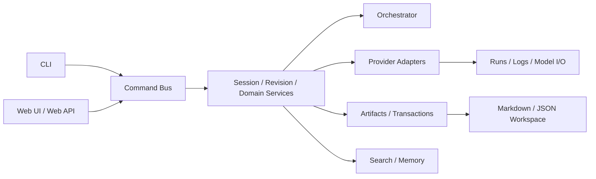
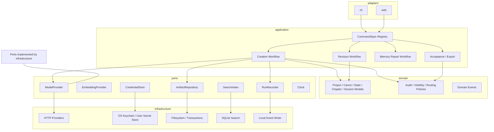
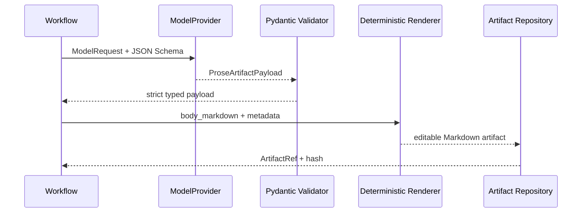

# WriterYang 项目全面评审报告

> 历史评审基线：本文件保留 2026-07-13 的原始问题判断。修复状态见文末“整改闭环记录”；现行规范以 `docs/PRODUCT_SPEC.md`、`docs/ARCHITECTURE.md` 和 `docs/SECURITY.md` 为准。

> 评审日期：2026-07-13
> 评审对象：`WriterYang` 当前 `main` 分支工作区
> 评审性质：代码、架构、文档、工程质量与产品体验的只读评审；本次不修改产品代码
> 结论等级：**有条件通过；在 P0 问题关闭前，不应宣称已完全满足项目架构约束**

## 1. 执行摘要

WriterYang 已经具备一个较完整的本地 AI 小说写作平台骨架：CLI 与 Web UI 共享 core logic，Command Bus 统一写操作，Creation/Revision Session 具有显式状态机，章节接受与导出前存在 freshness、audit、hash、transaction 等完整性门禁，Provider adapter 与 agent logic 基本分离，Orchestrator 也已经采用结构化模型决策、置信度门禁和保守 fallback，而不是依赖单纯关键词路由。项目的自动化测试、构建、wheel 安装与本地 Web E2E 在本次评审中均通过。

但当前实现仍有两个直接违反项目硬约束的 P0 问题：

1. Setup 流程把真实 API Key 写入项目根目录 `.env`，并可能生成同目录备份。虽然文件已被 Git、Web 文件树、日志和导出排除，权限也被收紧，但它仍然是“项目文件”，与“永远不要把 API key 存入项目文件”的架构原则直接冲突。
2. Writer、Polish 和完整 Revision agent 的 inter-agent 输出仍是裸 Markdown；其 prompt 甚至明确要求“不要输出 JSON”。这与“所有 inter-agent 输出都必须使用 structured schema”直接冲突，并迫使系统用中文短语黑名单检查模型正文，容易误判合法小说内容。

此外，项目存在若干 P1 风险：允许绑定非 loopback 地址但没有认证；Host/Origin 校验可被非浏览器客户端伪造；Web 单页工作台信息密度过高且 sticky 命令区会遮挡内容；Search 在查询热路径重复扫描、哈希、全表加载和全量重建；Provider 的所谓 streaming 实际先把整个 SSE 响应读入内存；Web 边界仍大量使用 `dict[str, object]`，未知异常被当作 HTTP 400 并把内部异常文本返回给用户；正式架构、产品需求和工作流文档被 `.gitignore` 排除，克隆与发行包中不可见。

本报告建议继续采用**模块化单体 + 本地文件工作区**，不引入微服务、消息中间件或分布式可观测性平台。当前最需要的不是增加更多基础设施，而是先关闭硬约束缺口，再拆分几个超大模块、收紧边界类型、简化搜索索引、降低 Web UI 的认知负担，并建立可发布、可验证的文档基线。

## 2. 评审范围、方法与限制

### 2.1 评审范围

本次覆盖：

- 项目结构与模块职责；
- 架构边界、数据流、工作流、完整性门禁及过度设计；
- Python、Web 静态前端、schema、prompt、测试与构建脚本；
- 接口、数据结构、Provider、错误模型；
- 依赖、Python 兼容性、发行物与 CI；
- 性能与资源使用的静态热点；
- 日志、trace、错误记录、留存策略；
- 安装、使用、配置、架构、API、数据结构、开发、测试、部署、发布、FAQ 等文档；
- Git 跟踪与 ignore 范围；
- 本地 Web UI 的真实浏览器流程与可访问性风险；
- 项目目标及 `AGENTS.md` 中硬性架构原则的落实情况。

### 2.2 执行过的验证

| 验证项 | 结果 |
|---|---|
| 项目聚合检查 `scripts/check_local.py --keep-going --json` | 通过 |
| pytest | `707 passed, 26 deselected, 7 subtests passed` |
| Ruff | 通过 |
| Mypy 普通检查 | 通过，检查 121 个源码文件 |
| Mypy strict 子集 | `contracts`、`workflow_runtime`、`artifact_store`、`transactions` 通过 |
| Secret scan | 通过；只证明未发现被跟踪的秘密，不证明项目 `.env` 符合架构要求 |
| build + twine | wheel、sdist 构建及检查通过；构建存在 MANIFEST 警告 |
| wheel 新鲜安装 smoke | import、版本、Web 资源、项目初始化与 validate 均通过 |
| `pip check` | 无已安装依赖冲突 |
| Web E2E | `5 passed, 728 deselected` |
| 浏览器 UX 走查 | 完成“打开 → 初始化 → 配置 → 工作台”关键流程取证 |

聚合检查第一次曾出现 build 子步骤失败，但单独复跑以及完整 JSON 复跑均成功，未形成可稳定复现的产品缺陷。它仍暴露出检查脚本的人类可读诊断不足：失败时需要开发者二次拆分执行才能定位。

### 2.3 本次没有覆盖的内容

- 没有调用真实付费模型或真实 embedding 服务；Provider 结论来自实现、mock/fault 测试和协议检查。
- 没有进行长篇百万字项目、并发多用户、持续运行数天的负载测试。
- 没有在 Windows、Linux、Python 3.14 上执行本地验证。
- 没有进行独立渗透测试、依赖漏洞数据库扫描或第三方无障碍审计。
- 没有测得覆盖率百分比，因此不能用“707 个测试”推导覆盖率充分。

## 3. 规模与结构基线

当前仓库是一个 Python `src` layout 项目，主体是模块化单体：

- 112 个源码 Python 文件，约 40,007 行；
- 52 个测试文件，约 22,339 行；
- 51 份导出的 JSON Schema；
- 当前 Git 跟踪 298 个文件，约 4.9 MB；
- 本地工作区约 102 MB，主要增量来自构建和测试缓存，而非仓库正文；
- Web UI 为原生 HTML/CSS/JavaScript 静态资源，由本地 `ThreadingHTTPServer` 提供；
- Canon、State、Timeline、Session、Artifact、Run trace 等均采用可编辑文件持久化，符合产品定位。

最大的复杂度集中在少数核心模块：

| 模块 | 约行数 | 主要风险 |
|---|---:|---|
| `core/session.py` | 2,700 | 工作流、节点执行、重写、projection、进度、恢复职责混合 |
| `core/search.py` | 2,146 | 收集、哈希、词法、向量、SQLite、manifest、刷新策略混合 |
| `core/command_bus.py` | 1,731 | 导入约 29 个内部模块，dispatcher、policy、handler 高耦合 |
| `core/providers.py` | 1,410 | 配置、HTTP、重试、流式解析、日志和多 Provider 行为集中 |
| `core/schemas.py` | 1,407 | 持久化模型入口，约 47 个模块依赖，变更半径过大 |
| `core/state_update.py` | 1,350 | 状态提议、校验与投影复杂度高 |
| `cli.py` | 893 | `build_parser()` 单函数约 811 行 |

这些数字本身不是缺陷，但结合职责混合、依赖扇出与测试定位成本，已经达到需要拆分的阈值。

## 4. 总体评分

评分采用 5 分制：5 为成熟，4 为可靠但仍有明确改进，3 为可用但有中等风险，2 为存在高风险缺口，1 为不具备基本能力。

| 评审维度 | 评分 | 结论 |
|---|---:|---|
| 1. 项目结构与模块划分 | 3.5 | 总体边界可识别，但数个 God Module 已形成 |
| 2. 架构设计与过度设计 | 3.0 | 完整性架构扎实；控制面和搜索复杂度领先于核心约束闭环 |
| 3. 代码质量与简洁性 | 3.5 | 自动门禁健康，局部函数和模块过长，lint/type 策略偏宽 |
| 4. 接口与数据结构 | 3.0 | 核心 control contract 强；Web/result/inter-agent 边界仍有弱类型 |
| 5. 依赖与兼容性 | 3.0 | 当前环境健康；版本声明、锁定、平台矩阵和安全扫描不足 |
| 6. 性能与资源使用 | 2.8 | 文本规模下可用；Search 和 Provider 流式实现存在结构性热点 |
| 7. 可观测性 | 3.5 | 本地 trace 丰富；轮转、并发写、安全错误分类和健康汇总不足 |
| 8. 文档完整性 | 2.8 | 使用/开发文档多；正式架构、需求、部署、安全文档缺口明显 |
| 9. 文档与代码一致性 | 2.5 | API Key、产品范围、完成度与当前代码存在明显冲突 |
| 10. 使用者体验 | 2.8 | 引导和反馈不错；主工作台拥挤、遮挡且技术细节过度暴露 |
| 11. 需求与目标一致性 | 3.0 | 多数核心目标已达成，但两条硬性架构原则未满足 |
| 12. Git 跟踪与 ignore | 3.5 | 运行产物和秘密排除合理；正式文档被错误忽略 |
| 13. 安全、发布与可维护性 | 3.0 | 本地默认相对安全；公开绑定、秘密存储与供应链门禁需加强 |

## 5. 值得保留的设计

后续重构不应破坏以下已经验证有效的能力：

1. **CLI 与 Web UI 共享 core logic。** 两个 surface 最终进入统一 Command Bus，而不是复制业务流程。
2. **写操作统一控制。** `CommandEnvelope`、确认、预算、lock、workflow run、changed artifact 等控制信息形成了可审计入口。
3. **状态机显式化。** Creation/Revision Session 的 transition 表和测试让非法跳转更难发生。
4. **章节接受和导出门禁强。** active plan、candidate、audit、state proposal、artifact hash、stale 检查、事务提交和回滚共同保护 canonical 文件。
5. **生成与接受语义分离。** 生成阶段更新 session projection 和提议，只有接受后才写 canonical state/timeline；这是正确的人机协作边界。
6. **Provider adapter 与 agent logic 基本分离。** 业务 service 不直接拼接各 Provider 私有 payload。
7. **高风险自然语言路由采用结构化 Orchestrator。** 模型输出经 schema、confidence、scope、manual review 和保守 fallback 约束，没有把 keyword-only classifier 当作主要决策机制。
8. **文件完整性措施扎实。** atomic write、file/directory fsync、artifact hash、project lock、heartbeat、transaction journal 和 fault-injection 测试覆盖了本地文件系统常见故障。
9. **隐私默认值较好。** model I/O 默认记录 metadata/摘要，Provider 日志有脱敏逻辑，不默认持久化完整 prompt/response。
10. **strict schema 已成为控制面主流。** Pydantic 模型大多 `extra="forbid"`，公开 command 使用 discriminator union，减少了隐式字段扩散。

## 6. 优先级问题总表

| ID | 优先级 | 问题 | 直接影响 |
|---|---|---|---|
| R-01 | P0 | API Key 被写入项目 `.env` 及备份 | 直接违反项目秘密存储原则 |
| R-02 | P0 | Writer/Polish/Revision inter-agent 输出为裸 Markdown | 直接违反全量 structured schema 原则 |
| R-03 | P1 | 非 loopback Web 绑定无认证，Host/Origin 可伪造 | 可能暴露任意项目路径与写操作 |
| R-04 | P1 | Web 工作台信息架构过载，sticky 区遮挡内容 | 主流程可用性和可访问性受损 |
| R-05 | P1 | Search 多份索引、查询前全量扫描、刷新全量重建 | 项目变大后延迟、I/O、内存线性放大 |
| R-06 | P1 | Provider 无响应体上限，streaming 实际全量缓冲 | 大响应内存风险、首 token 延迟、无法及时取消 |
| R-07 | P1 | Web 边界和返回值弱类型，未知异常返回 400 与内部文本 | API 可理解性、客户端稳定性和安全性不足 |
| R-08 | P1 | 正式需求/架构/工作流文档被 ignore | clone、sdist 和开发者无法获得权威设计基线 |
| R-09 | P1 | Session、Command Bus、Schemas、CLI Parser 超大 | 变更半径、评审成本、回归风险持续上升 |
| R-10 | P2 | 依赖不锁定、Python 支持声明过宽、CI 平台单一 | 构建不可复现，未来版本漂移 |
| R-11 | P2 | 日志留存和并发写缺少统一策略 | 长期占盘、JSONL 交错、故障难归类 |
| R-12 | P2 | 测试缺覆盖率、性能基线、无障碍和安全供应链门禁 | 难判断未覆盖区域和容量退化 |
| R-13 | P2 | MANIFEST 与包内 schema 布局漂移 | 构建警告、发行内容不可预测 |
| R-14 | P2 | 历史设计/完成审计与现状混放 | 新开发者可能把历史结论当当前规范 |
| R-15 | P3 | `FlexibleModel` 命名、Ctrl-C traceback 等局部质量问题 | 认知负担与命令行体验 |

## 7. 单点问题详述与优化方案

### R-01：项目内明文保存 API Key

**证据**

- `src/novel/core/env.py:10-11` 固定把 project env 定义为 `<root>/.env`；写入函数会生成备份并设置权限。
- `src/novel/core/setup_guide.py:120-128` 和 `:209-217` 把默认 Provider 与 Embedding API Key 交给该写入函数。
- `src/novel/web_static/index.html:130-152,696-701` 明确告诉用户“API Key 会保存到项目 `.env`”。
- 测试也把“Key 出现在项目 `.env`”作为预期行为。

**问题与影响**

当前实现已经通过 `.gitignore`、Web 文件树隐藏、日志脱敏、导出排除和 `0600` 权限降低误泄漏概率；这些措施值得保留。但它们不能改变 `.env` 属于项目目录文件这一事实。备份还会制造额外明文副本。该实现与项目硬约束直接冲突，因此不能降级为普通文档问题。

**优化方案**

引入 `CredentialStore` port，默认顺序为：

1. 当前进程环境变量；
2. OS Keychain/Keyring；
3. 仅当系统密钥存储不可用时，使用项目目录外的用户级私密文件，例如 `~/.config/writeryang/credentials.json`，权限 `0600`。

项目中的 YAML/JSON/Markdown 只保存 `credential_ref` 或环境变量名。Web Setup 把输入包装成不可序列化的 `SecretValue`，传给 `CredentialStore` 后立即丢弃；Command result、workflow trace、repr、`model_dump()` 和错误详情都必须排除该值。当前项目 `.env` 与备份应提供一次性迁移/删除命令。项目明确不要求历史兼容，因此不应长期保留旧读取路径。

**验收标准**

- 初始化、配置、运行、日志和导出路径中，项目目录内不出现真实 API Key。
- `novel doctor` 能发现旧 `.env`/备份中的疑似 Provider secret，并提供迁移与清理。
- 包含 CLI、Web、异常、trace、backup 和 dump 的泄漏测试。
- UI 和全部文档不再表述为“写入项目 `.env`”。

### R-02：部分 inter-agent 输出仍是裸 Markdown

**证据**

- `src/novel/core/agent_output.py:17` 允许 `json | markdown | conversation` 三种 output kind。
- `drafting.py:143`、`polishing.py:159`、`revision.py:134` 对 Writer、Polish、完整 Revision 使用 `output_kind="markdown"`。
- 对应 system prompt 明确写有“不要输出 JSON”。
- Markdown 检查器依赖“大纲”“我不能”“Canon”等硬编码短语识别错误输出。

**问题与影响**

裸正文缺少 agent name、schema version、task、source artifact、warnings、assumptions 等可验证 envelope。系统只能对自然语言做启发式检查，合法小说正文若包含相关短语可能被误判；反之，换一种说法的元话语又可能漏过。这既违反结构化 inter-agent 约束，也降低审计与演进能力。

**优化方案**

为三类 agent 分别定义 strict payload，或者统一为 `ProseArtifactPayload`：

```text
schema_version
artifact_kind        # chapter_draft | polished_chapter | revision
chapter_number
body_markdown
source_artifact_refs
assumptions
warnings
change_summary
task_id / request_id
```

Provider 层使用 JSON Schema/tool response 请求结构化返回；Pydantic 校验后，由 deterministic renderer 把 `body_markdown` 渲染到可编辑章节文件。短语 heuristic 只保留为低置信度 warning，不能作为结构有效性的主要判据。如果个别模型对大型 JSON 正文稳定性差，可使用明确的 typed multipart envelope，但进入 core 的边界仍必须转换为 schema 对象。

**验收标准**

- 所有 agent 到 core、agent 到 agent 的结果都先通过 strict schema。
- prompt、契约和导出 schema 一致；Writer/Polish/Revision 不再声明“不输出 JSON”。
- 正文仍以 Markdown 形式落盘并可人工编辑。
- 测试覆盖中文对白含“大纲”“我不能”等词时不会被错误拒绝。

### R-03：Web 暴露模型在非 loopback 绑定时不安全

**证据**

- `novel web --host` 接受任意 host，server 使用 `ThreadingHTTPServer((host, port), ...)`。
- API 防护只检查 `Host` 和 `Origin` 是否看起来是 localhost。
- `is_allowed_api_source(host_header=None, origin_header=None)` 当前返回 `True`；缺少 Origin 也直接放行。
- 非浏览器客户端可以把 `Host` 伪造成 `localhost`。没有 bearer token、session auth 或客户端地址校验。
- API 可以接受 project path，并包含大量写操作。

**问题与影响**

默认绑定 `127.0.0.1` 是安全的好默认值；问题出在系统允许用户绑定 `0.0.0.0` 等地址，却仍把可伪造的请求头当作访问控制。只要端口可达，远程客户端就可能读取或修改宿主机上的项目数据。

**优化方案**

- 默认且普通模式只允许 loopback host；对其他 host 直接启动失败并给出说明。
- 如果未来确有远程模式需求，必须使用显式 `--listen-public`，启动时生成随机 bearer token，增加 CSRF、认证失败审计、反向代理/TLS 指南与严格 project root allowlist。
- 缺失 Host 的浏览器 API 请求应拒绝；Origin 可作为 CSRF 辅助信号，但不能当认证。
- 在没有远程产品需求前，不要为了“通用性”实现复杂账户系统；简单禁止公开绑定最符合当前本地产品定位。

**验收标准**

- 普通命令无法绑定非 loopback 地址。
- 自动化测试覆盖 IPv4、IPv6、伪造 Host、缺失 Host/Origin 与代理头。
- 若引入 public mode，所有 `/api` 请求必须认证，且项目路径被 allowlist 限制。

### R-04：Web 工作台信息架构与 sticky 遮挡

**证据**

- 初始化前页面已经显示预览、导出等大量尚不可执行的控件。
- 一个页面同时容纳 Session、Revision、设置变更、Canon、State/Timeline、预览、运行日志、编辑器、diff、audit、Provider 配置等能力。
- `app.css:33-53` 让命令区 sticky，并给 artifact preview `min-height: 140px; max-height: 24vh`。
- 1264×800 实测时 sticky 命令区遮挡下方 Canon/项目准备控件；自动化点击被判断为 target obscured。
- 大量标签、说明、运行面板使用 12px 字号；顶部三栏与六个导航按钮在中等宽度换行。

**问题与影响**

系统能力很丰富，但主用户是小说作者，不应在同一视图同时承担运行时操作者、配置管理员和数据修复工程师的认知负担。遮挡不是纯审美问题，它会阻止主要操作，并影响键盘焦点可见性和移动/窄屏体验。

**优化方案**

由后端输出统一 `ViewState` 或 `next_allowed_commands`，前端只显示当前阶段的一个主 CTA 和少量次要动作。信息架构建议拆为：

1. 开始：打开、初始化、最近项目；
2. 配置：Provider、Embedding、连通性；
3. 创作：需求输入、Session、大纲、正文；
4. 审阅：audit、revision、diff、accept；
5. 资料库：Canon、State、Timeline、Memory；
6. 运维：日志、预算、配置、索引和诊断。

命令区应改为非 sticky，或折叠成单行 composer；预览放入侧栏/drawer。若保留 sticky，必须动态计算实际高度并设置每个 anchor 的 `scroll-margin-top`，不能依赖固定 76px。技术运行面板默认折叠，字号和触控目标遵循可读性基线。

**验收标准**

- 关键流程在 1280×720、1024×768 和窄屏下无元素遮挡。
- 任一阶段只有一个清晰 primary action；无效动作隐藏或解释原因。
- 完成键盘全流程、焦点可见、屏幕阅读器状态通知和颜色对比测试。
- 作者默认视图不直接暴露 request ID、node 细节和底层配置。

### R-05：Search 的存储与热路径复杂度不匹配

**证据**

- 当前同时维护 JSON index、SQLite index 和 manifest 三种表示。
- `search_project()` 在查询前调用 `search_index_status()`；后者调用 `_collect_documents()`，重新遍历项目文件。
- Canon/State/Timeline 采集过程中，单一源文件可能对每个实体重复做文件 hash。
- 刷新虽然计算 stale document，却在 `_write_sqlite_index()` 中 `DROP TABLE` 后重建 documents、vectors 和 FTS 表。
- 向量检索把全部 vector JSON 从 SQLite 读入 Python，再逐条 `json.loads` 和 cosine，复杂度近似 `O(N×D)`。

**问题与影响**

当前本地小项目下很快，但长篇小说的实体、章节、片段和 embedding 数量会持续增长。查询前重复扫描会直接增加交互延迟；全量向量加载会放大内存；三份索引状态增加一致性和恢复分支。这里体现为“设计形态很复杂，但关键路径仍是全量算法”。

**优化方案**

- 以 SQLite 为唯一查询索引；manifest 变为 SQLite 内的 source 表，或一个很小的 source manifest。
- 每个源文件只读取和 hash 一次，实体级 hash 对规范化序列化内容计算。
- 使用事务内 UPSERT/DELETE 做增量刷新，不删除重建全部表。
- FTS 先返回候选集合，向量只对候选或受限 top-K 评分。
- 向量改用 compact BLOB/array；只有测量证明必要时才引入 ANN，不要现在加入独立向量数据库。
- 默认显式或后台刷新，不在每次 foreground 查询前做全项目重算。

**验收标准**

- 建立 10、100、500 章项目基准，记录 p50/p95 查询和刷新时间、峰值内存、hash 文件数。
- 修改一个章节只更新受影响文档；数据库表不全量重建。
- 搜索结果正确性、stale 识别和崩溃恢复测试保持通过。

### R-06：Provider 响应无上限，streaming 名实不符

**证据**

- `providers.py:781` 使用 `response.read().decode(...)` 一次读完整响应。
- stream 分支先返回完整字符串，再解析 SSE，`yield` 发生在全量完成之后。
- retry 使用线性固定 sleep，未读取 `Retry-After`，也无 jitter。

**问题与影响**

这不是实际流式传输：用户无法尽早看到 token，取消操作无法及时释放连接，大响应会瞬间占用内存。对异常或恶意 Provider，缺少最大 body 限制会形成资源风险。固定重试在多个请求同时失败时容易同步重试。

**优化方案**

- 非流式响应用有上限的分块读取；超过上限抛 typed `ProviderResponseTooLarge`。
- 流式响应逐行解析 SSE，边读边产出，支持 cancellation、deadline 和 backpressure。
- 遵守 `Retry-After`；否则使用 exponential backoff + bounded jitter。
- 若短期不实现真 streaming，应把能力命名为 buffered response，避免接口误导。

**验收标准**

- 测试首 token 延迟、取消、断流、超大 body、非法 UTF-8、SSE 多行 data 和重试头。
- 记录响应字节数、首 token 时间、总时间和 attempt count，但不记录秘密或正文。

### R-07：Web API 和 command result 边界弱类型

**证据**

- Web endpoint 多处接收 `dict[str, object]` 并手工取字段。
- `CommandResult.result`、`WebResponsePayload.data` 是通用字典。
- Setup/AgentConfig 某些嵌套结构仍是原始 dict。
- 未知异常在 `web_api/router.py:179-180` 被映射为 HTTP 400 `operation_failed`，并把 `str(exc)` 返回客户端。
- 没有可生成的 OpenAPI 或逐 command 的 request/response 文档。

**问题与影响**

核心 command 已经 strict，但最外层 HTTP 和最内层 result 重新失去类型。前端无法可靠区分返回结构，新增 command 时需要同步维护多个手工分支。未知异常应是 500；返回内部异常文本可能泄露路径或实现细节，也会误导监控把服务故障统计成用户输入错误。

**优化方案**

- 建立 `CommandSpec[Request, Response]` registry，每个 command 显式绑定输入、输出、权限、确认、预算和 handler。
- Web request 先解析为 Pydantic request model；response 为 discriminator union。
- 由 registry 生成 OpenAPI/JSON Schema、CLI 参数帮助和前端类型。
- 建立 typed error hierarchy：`code`、`http_status`、`retryable`、`user_message`、`request_id`、可选安全 details。
- 未知异常返回 500 与通用消息；详细 stack 只进入本地受控日志。

**验收标准**

- 每个 `/api` endpoint 无裸业务 dict 输入。
- 每个 command 有唯一 request/response schema 与错误清单。
- contract snapshot、前端解析与文档生成在 CI 中验证。

### R-08：正式架构与产品文档没有发布

**证据**

- `.gitignore` 排除了 `docs/PRODUCT_SPEC.md`、`docs/ARCHITECTURE.md`、`docs/WORKFLOW.md`、`docs/ROADMAP.md`。
- `MANIFEST.in` 也显式排除这些文件。
- 它们本地存在，但 clone、GitHub、sdist 和新开发者均看不到。
- `PRODUCT_SPEC.md` 为英文，且仍描述 CLI-first、minimal Web 等已变化范围。

**问题与影响**

项目规则只要求“仅给 coding Agent 的本地文档”不被 Git 跟踪。产品需求、现行架构、工作流和 roadmap 属于面向开发者与使用者的正式项目文档，不应被当作本地 agent memory。权威设计基线不可发布，会放大代码与文档漂移。

**优化方案**

- 将当前有效的产品需求、架构、工作流、roadmap 改为中文并纳入 Git。
- 仅把 agent 私有指令、临时计划、协作日志放在 `AGENTS.md`、`.agents/`。
- 设 `docs/index.md` 为唯一文档目录，README 只保留入口。
- 对历史评审移至 `docs/history/` 并加醒目的“历史材料，不代表当前设计”标识。

**验收标准**

- 新 clone 无需本地隐藏文件即可理解产品目标、架构边界、核心数据流和开发流程。
- 文档存在 owner、`last_verified_commit` 或版本标识。
- CI 检查链接、必备章节、生成 schema 和关键命令示例。

### R-09：核心模块过大，应用层职责没有充分分离

**证据**

- `session.py` 约 2,700 行，`run_session()` 约 411 行。
- `command_bus.py` 约 1,731 行并导入大量领域模块。
- `schemas.py` 约 1,407 行且被大量模块直接依赖。
- `cli.build_parser()` 约 811 行。
- `search.py` 同时承担 repository、indexer、query engine、embedding orchestration 和 manifest。

**问题与影响**

当前不是“没有分层”，而是分层在继续扩展功能时被少数聚合模块重新吞并。修改一个 workflow 节点、command 或 schema 容易触发横跨 core、Web、CLI、测试和文档的高扇出变更，代码评审也难聚焦。

**优化方案**

采用第 9 节目标架构，在单一进程内按 domain/application/ports/infrastructure/adapters 拆分。重点是移动职责和依赖方向，不是增加网络边界。Command Bus 只保留 dispatch 与横切 policy；每个领域 command handler 放入对应 application 模块。Session 拆成 workflow aggregate、node executor、rewrite coordinator、projection service、acceptance service 和 progress repository。持久化 schema 按 project/canon/state/chapter/session 分域。

**验收标准**

- Command Bus 不直接导入所有领域实现，而通过 registry 装配 handler。
- 单个 workflow service 可在无 CLI/Web 的测试中执行。
- domain 不依赖 infrastructure 或 adapters。
- 不以“文件必须少于某行”作为唯一目标，但核心模块职责可用一句话描述，新增 command 不需修改中央巨型 `if/elif`。

### R-10：依赖、兼容性与供应链基线不足

**证据**

- `requires-python = ">=3.11"`，但文档和 CI 实际只承诺 3.11–3.13；包元数据隐含支持 3.14 及未来版本。
- runtime/dev/build 依赖只有下界，没有 lock/constraints。
- CI 只在 Ubuntu 运行 3.11、3.12、3.13；Web E2E 只跑 3.12；没有 macOS/Windows 矩阵。
- 没有 Dependabot/Renovate、OSV/pip-audit、CodeQL 或等价门禁。
- GitHub Actions 使用可变 major tag，没有 pin 到 commit SHA。

**当前上游状态**

本次核对时，[Pydantic](https://pypi.org/project/pydantic/) 稳定版为 2.13.4，[PyYAML](https://pypi.org/project/PyYAML/) 为 6.0.3，[python-docx](https://pypi.org/project/python-docx/) 要求 Python 3.9+；开发工具 [pytest](https://pypi.org/project/pytest/)、[Ruff](https://pypi.org/project/ruff/) 和 [mypy](https://pypi.org/project/mypy/) 的最新版本已经分别高于当前环境中的部分版本。这说明“只有下界”会使不同时间的 CI 自动选择不同工具链，不能保证复现。

**优化方案**

- 在尚未验证 3.14 前声明 `>=3.11,<3.14`；或者将 3.14 加入 CI 后再放宽。
- runtime 依赖使用兼容上界；dev/CI 使用受审 constraints/lock，并由自动更新 PR 维护。
- Ubuntu 保持主矩阵，至少增加一个 macOS smoke；Windows 若明确不支持，应在元数据和文档中写清。
- CI 增加依赖漏洞扫描和 license 检查；Actions pin 到 commit SHA。

**验收标准**

- 同一 commit 在不同时间能解析到同一验证工具链。
- 包元数据、README、CI 矩阵一致。
- 依赖更新由可审计 PR 完成，而不是每次 CI 随机漂移。

### R-11：可观测性缺少统一 writer、留存与健康视图

**证据**

- 已有 workflow run/node/decision、provider call、model I/O、progress、lock heartbeat、management event，基础很好。
- `app.log` 使用普通 `FileHandler`，无 rotation；日志初始化失败被吞掉。
- `provider_calls.jsonl` 等 append 依赖普通文件追加，没有统一的进程内 writer/文件锁/fsync 策略。
- model I/O 有数量/体积留存，但 app log、provider calls、workflow run 目录、lock event、agent violation、transaction journal 没有统一 retention。
- failed node 主要记录 `str(exc)`，缺少稳定 error class/code/retryable。

**问题与影响**

本地产品不需要上来就部署 Sentry、OpenTelemetry collector 或监控集群；但如果本地事件并发写入交错、日志无限增长、错误全靠文本搜索，现有丰富 trace 也难真正用于定位问题。

**优化方案**

- 建立一个本地 `EventWriter`：结构化 schema、串行/加锁写、flush 策略、按大小和天数轮转、总量上限。
- 所有事件拥有 `timestamp`、`request_id`、`workflow_run_id`、`node_id`、`event_type`、`status`、`duration_ms`、`error_code`。
- `novel doctor`/Web health 页面汇总成功率、最近失败、锁等待、索引耗时、Provider retry、repair count 和磁盘占用。
- 完整正文继续默认不记录；full mode 必须明确隐私警告和独立留存。

**验收标准**

- 并发 Web 请求下每行 JSONL 都可独立解析。
- 长期运行不会无限占盘；清理操作本身可审计。
- 用户可用 request ID 从错误页定位到本地 trace，而不暴露 stack 给前端。

### R-12：质量门禁范围仍不充分

**证据**

- Ruff 只选择 E/F 且忽略 E501。
- Mypy 全局 `strict_optional=false`、`check_untyped_defs=false`、`warn_unused_ignores=false`；strict 只覆盖少数高风险模块。
- 没有 coverage 工具和阈值。
- 没有明确的大项目性能、资源上限、无障碍和公开绑定安全测试。
- 静态死代码扫描只发现 `ProjectLock.__exit__` 的 `exc_type`、`tb` 未使用，但该工具未纳入 dev dependency/CI。

**优化方案**

分阶段强化而不是一次性打开全部规则：

1. 先把所有新/改文件纳入 stricter mypy；逐域扩大 strict 子集。
2. Ruff 增加 I、UP、B、SIM 等低误报规则，并用单独 PR 机械修复。
3. 采集 coverage 基线，先展示不设阻断，再对核心状态机、transactions、security 和 command contracts 设置分域阈值。
4. 加入规模化 search benchmark、Provider fault cases、Web keyboard/a11y smoke 和 host spoof tests。

**验收标准**

- 每类高风险行为都有失败测试，不只检查源码是否包含某个关键词。
- 性能基准保存历史并设合理退化阈值。
- 质量门禁失败能输出直接可执行的诊断。

### R-13：发行清单与 schema 安装位置不够稳健

**证据**

- build 会警告 `MANIFEST.in` 引用不存在或被排除的 `AGENTS.md`、`PRODUCT_SPEC.md`、`ARCHITECTURE.md`、`WORKFLOW.md`、`ROADMAP.md`、`examples`。
- `DATA_SCHEMA.md` 没有进入 MANIFEST 的显式文档列表。
- wheel 把 JSON Schema 作为顶层 `data-files` 安装到通用 `schemas/`，而非 `novel` 包资源。

**问题与影响**

当前 wheel smoke 通过，因此不是发布阻断项。但顶层 data-files 容易与其他包冲突，且 MANIFEST 的手工列表已经与仓库漂移。

**优化方案**

- 将运行时需要的 schema 放入 `novel/schemas/` package data，通过 `importlib.resources` 访问。
- 面向外部集成者的 schema 可以在 release artifact 中另行发布。
- MANIFEST 使用清晰 allowlist，并在 CI 比较期望 sdist/wheel 文件清单。

**验收标准**

- build 无警告。
- fresh venv 中 package schema 可读取，卸载不影响其他包。
- sdist/wheel 内容 snapshot 经审查并稳定。

### R-14：历史文档与当前规范混放

**证据**

`docs/` 根目录包含带日期的设计评审、优化计划和“完成审计”。它们记录了当时决策，具有价值，但其中某些“已全部关闭”的结论与当前 P0 缺口并不一致，也包含已经移除的 API/范围。

**优化方案**

- 移入 `docs/history/`；文件顶部写明适用 commit、当时范围与“非现行规范”。
- 现行架构只在一个 canonical `ARCHITECTURE.md` 维护。
- CHANGELOG 只记录用户可感知变化；设计过程留在 history/ADR。

### R-15：局部命名和 CLI 体验问题

- `FlexibleModel` 实际也 `extra="forbid"`，名称暗示与行为相反；应改成表达用途的 `PersistenceModel` 或具体领域基类。
- Ctrl-C 停止 Web server 会显示完整 `KeyboardInterrupt`/Conda traceback；应捕获并输出简洁“服务已停止”。
- `ProjectLock.__exit__` 的协议参数未使用可显式命名为 `_exc_type`、`_tb`，或接受静态工具的 context manager 约定。

## 8. 十三个评审维度的综合结论

### 8.1 项目结构与模块划分

总体结构合理：`core`、`contracts`、`web_api`、`web_static`、prompts、tests、schemas、scripts 均可辨认，CLI/Web 共用核心实现。问题集中在 `core` 内部的应用层、领域层和 infrastructure 边界仍不够清晰，新增功能长期汇入 `session.py`、`command_bus.py`、`search.py` 和 `schemas.py`。建议拆分模块化单体，不建议拆微服务。

### 8.2 架构设计与过度设计

完整性相关复杂度——artifact lineage、hash、audit、transaction、lock、projection、acceptance gate——与“AI 写作不能静默污染 canon”这一风险匹配，属于必要复杂度。过度设计主要出现在两处：

- 产品仍处本地单用户阶段，却同时建设了庞大的通用 command/control/runtime 体系、51 个导出 schema 和多层 trace；
- Search 维护三份索引表示，却仍使用全量扫描/重建和 Python 全量向量计算。

判断标准不应只是 LOC，而应看这些复杂度是否关闭了最优先的硬约束。当前答案是否定的：系统已经能追踪大量 artifact 和 node，但仍把 secret 放进项目、把关键 agent 正文当裸字符串。因此后续应停止横向扩张，先做约束闭环和收敛。

### 8.3 代码质量与简洁性

优点是代码一致性高、类型注解覆盖广、异常大多领域化、纯函数与显式模型较多，测试反馈快速。主要问题是大型函数、弱 mypy 全局配置、宽松 lint 和少量重复模型/解析逻辑。建议以领域拆分和类型收紧为主，不要做仅为减少行数的碎片化重构。

### 8.4 接口与数据结构

控制面 schema 强，持久化格式可编辑，状态机和 artifact ref 清晰。弱点是 inter-agent 正文、HTTP body、generic result/data、错误模型以及秘密类型。应建立 command registry、typed response union、structured prose envelope 和专门 `SecretValue`。

### 8.5 依赖与兼容性

当前 Python 3.12 环境和 fresh wheel 安装健康，依赖数量也不算膨胀。风险在声明与验证不一致、没有可复现锁定、平台矩阵单一和供应链扫描缺失。`python-docx` 是主要导出能力的一部分，当前保留为 runtime dependency 可以接受；若未来核心安装需要更轻，可再移到 `docx` extra，但不应为了三个依赖过早做复杂插件化。

### 8.6 性能与资源使用

文件事务和全量文本读写对普通小说规模可以接受。真正需要优先处理的是 Search 热路径和 Provider streaming。Web server 暂时无需迁移到 async 框架；在单用户本地场景，`ThreadingHTTPServer` 足够，先做认证边界、取消和有界 I/O 更有价值。

### 8.7 可观测性

项目的本地 trace 设计已经明显高于普通原型，尤其是 workflow/node/decision 与 provider/model I/O 关联字段。下一步应统一 schema、留存和错误分类，而不是引入分布式 tracing 平台。

### 8.8 文档完整性

详见第 11 节。结论是“数量多，但权威性和发布范围不足”。安装、快速开始、CLI、Web、开发、发布已存在；正式架构、需求、部署边界、安全响应、完整 API 与配置参考不足。

### 8.9 文档与代码一致性

最严重的不一致是 API Key 描述自相矛盾：同一文档既说可放项目 `.env`，又说不要写项目文件。其次是本地 PRODUCT_SPEC 仍把 Web 描述为 minimal、CLI-first；完成审计的范围标签不足；README 文档地图遗漏 `DATA_SCHEMA.md`。现有链接检查没有发现本地断链，但“链接可达”不等于内容正确。

### 8.10 使用者体验

新用户初始化、字段 label、状态反馈、下一步提示和 accepted/revision 区分做得不错；浏览器控制台在本次流程没有错误。主要问题是把过多管理能力放在作者主流程、sticky 遮挡、操作门禁主要靠 disabled 控件而非渐进披露、技术状态过于显眼。详见第 12 节。

### 8.11 需求与目标一致性

多 agent、可编辑 memory、CLI/Web 共核、Provider 分离、章节接受/导出一致性、结构化 orchestrator 均基本达成。API Key 与全部 inter-agent structured schema 两条未达成，因其属于硬约束，应判为整体“有条件通过”，不能以功能丰富度抵消。

### 8.12 Git 跟踪与 ignore

`.env*`、`.agents/`、`AGENTS.md`、runs、index、lock、backup、cache 等排除合理；本地协作记录保持未跟踪也符合规则。问题是正式产品/架构文档被一并排除，以及 `myNovel/` 只硬编码忽略一个默认目录。建议把用户 workspace 放在仓库外，或统一到 `.writeryang-workspaces/`；不要用宽泛规则误伤任意小说目录。

### 8.13 其他：安全、发布、可维护性

需要补充 `SECURITY.md`、威胁模型、依赖安全扫描和公开绑定政策。当前默认本地模型降低了攻击面，但不应把“默认只在 localhost”当作允许不安全 public host 参数的理由。项目也需要明确哪些功能是产品承诺、哪些是实验性，以免控制面持续膨胀。

## 9. 架构级变动建议

### 9.1 当前架构的核心问题

当前运行链路大致如下：



该结构方向正确，但存在四个架构级问题：

1. Command Bus 既做横切 policy，又知道大量领域实现；
2. Session 既是状态机，又是应用服务、节点 executor、projection 管理器和恢复器；
3. domain model、persistence model、HTTP contract 与 agent contract 分散在多个大文件和导出 schema 中；
4. Credential、Search、Observability 等 infrastructure 细节没有稳定 port，因而业务层直接承受存储策略复杂度。

### 9.2 架构级变动的必要性

只修单点会出现以下反复：

- 把 `.env` 改成另一个路径，却没有统一 CredentialStore，CLI/Web/Provider 继续各自理解 secret；
- 把 Markdown 外面套一个字典，却没有 structured agent contract + deterministic renderer，正文验证仍靠 heuristic；
- 把 `session.py` 切成多个文件，但依赖方向不变，形成更多互相导入的小文件；
- 优化一次 Search 查询，却继续维护三份状态，后续 stale/recovery 分支继续增长。

因此需要一次有边界的架构收敛：保留部署形态和文件模型，重新明确依赖方向与 owner。它不是“重写”，而是围绕当前有效能力建立清晰 seams。

### 9.3 推荐的新架构：模块化单体



> 图中的 ports 是 Python protocol/interface，不是网络服务。所有模块仍在同一进程、同一仓库、同一发布包中运行。

### 9.4 目标模块职责

| 层 | 职责 | 禁止事项 |
|---|---|---|
| `adapters/cli` | 参数解析、命令展示、exit code | 不直接操作 project 文件或 Provider |
| `adapters/web` | HTTP model、静态资源、response mapping | 不拼业务 dict，不返回原始异常 |
| `application/commands` | CommandSpec、dispatch、确认/预算/lock policy | 不包含具体领域算法 |
| `application/workflows` | 编排 creation/revision/repair 节点和 human gate | 不直接实现 HTTP/SQLite/Keychain |
| `domain/models` | Project、Canon、State、Timeline、Chapter、Session invariant | 不依赖 adapters/infrastructure |
| `domain/policies` | consistency、visibility、routing、acceptance policy | 不做文件 I/O |
| `ports` | Provider、Credential、Artifact、Search、RunRecorder、Clock 协议 | 不绑定具体库 |
| `infrastructure` | 文件、SQLite、HTTP、Keychain、日志实现 | 不决定业务工作流 |

### 9.5 Structured prose 的目标数据流



这使“inter-agent 输出结构化”和“memory/章节可编辑 Markdown”同时成立，二者并不冲突。

### 9.6 不建议的架构变动

当前阶段不建议：

- 拆成多个微服务；
- 引入 Kafka/RabbitMQ/event sourcing 平台；
- 引入外部向量数据库；
- 为本地单用户产品部署 Prometheus、Jaeger、Sentry 全套服务；
- 把所有文件数据立即迁入数据库；
- 因为 Web UI 复杂就直接迁移 React/Next.js，而未先修正 ViewState 与信息架构。

这些变动会增加部署、兼容、数据迁移和调试成本，却不能直接关闭当前 P0。

## 10. 需求与目标对齐矩阵

| 项目需求/原则 | 当前状态 | 评审结论 | 后续动作 |
|---|---|---|---|
| 支持 multi-agent workflow | 已有 Orchestrator、Planner、Writer、Polish、Audit、State Update 等专职节点 | 基本满足；是中央编排式 multi-agent，不是自治 agent 辩论 | 文档明确产品定义和非目标 |
| Agent memory 为可编辑 Markdown/JSON | Canon、State、Timeline、Memory、Chapter 均文件化 | 满足 | 保持，不迁入黑盒数据库 |
| 所有 inter-agent 输出使用 structured schema | Writer/Polish/完整 Revision 为裸 Markdown | **不满足，P0** | 引入 structured prose envelope |
| API Key 永不存入项目文件 | Setup 写 `<project>/.env` 和备份 | **不满足，P0** | CredentialStore + 项目外 secret |
| Web UI 与 CLI 共享 core logic | 统一 Command Bus/core services | 满足 | 防止 adapter 绕过 CommandSpec |
| 每次章节生成更新 timeline/state | 生成更新 session projection/proposal；接受写 canonical | 语义上满足，但文档需区分 projection 与 canonical | 写入架构文档和验收测试 |
| export 前通过 consistency audit | export freshness 与 acceptance transaction 有强门禁 | 满足且设计优秀 | 保持故障/篡改测试 |
| 高风险 routing 不以 keyword matching 为主 | structured Orchestrator + confidence/manual fallback | 满足 | 保留 keyword heuristic 仅作辅助 warning |
| 使用 typed schema | 控制面较强，Web/result/prose 有缺口 | 部分满足 | 收紧边界类型 |
| 为 state transition 添加测试 | 有显式 transition 与测试 | 满足 | 加 property/fault cases 可选 |
| Provider adapter 与 agent logic 分离 | 基本分离 | 满足 | 进一步以 port 固化边界 |
| 文档全部中文 | 多数为中文；本地 PRODUCT_SPEC 为英文 | 部分满足 | canonical 文档中文化 |

## 11. 文档完整性矩阵

| 文档类型 | 当前材料 | 完整性 | 主要问题 | 建议 |
|---|---|---|---|---|
| 安装说明 | `README.md`、`QUICKSTART.md` | 较完整 | 平台支持边界与 Python 元数据不完全一致 | 增加系统要求、验证矩阵 |
| 使用说明 | README、CLI、Web 用户指南 | 完整 | 页面与功能多，入口稍分散 | docs index + task-based 导航 |
| 配置说明 | README、开发指南、Model Config 文档 | 部分完整 | 环境变量散落；API Key 表述冲突 | 单一 `CONFIGURATION.md`，字段表和优先级 |
| 架构说明 | 本地忽略的 `ARCHITECTURE.md`、历史评审 | **发布缺失** | clone/sdist 不可见，现行与历史混杂 | 中文 canonical 架构文档纳入 Git |
| API 文档 | `INTEGRATION.md`、CLI commands | 部分完整 | 无生成式 OpenAPI、请求/响应 schema 和错误表 | 从 CommandSpec 生成 |
| 数据结构说明 | `DATA_SCHEMA.md`、`schemas/` | 较完整 | README 未链接，sdist 清单不明确；prose contract 缺失 | 纳入 docs index，补 owner/生成关系 |
| 开发指南 | `DEVELOPER_GUIDE.md`、CONTRIBUTING | 完整 | API Key 章节自相矛盾；AGENTS Commands 为空 | 修正文档并补本地命令 |
| 测试说明 | README、开发/调试文档 | 较完整 | 无 coverage、perf、security、a11y 基线 | 增加测试金字塔和门禁说明 |
| 部署说明 | Release 文档与本地 Web 命令 | 不完整 | 本地应用非部署产品，但未形成明确 deployment/security policy | 写 `DEPLOYMENT.md`，声明 loopback-only 与非目标 |
| 变更记录 | `CHANGELOG.md` | 存在 | 应与版本发布自动校验 | 发布 CI 检查版本和 changelog |
| 常见问题 | README FAQ | 基础存在 | API Key FAQ 自相矛盾，故障覆盖少 | 扩展到 Provider、lock、audit、index、恢复 |
| 安全文档 | 无独立 `SECURITY.md` | 缺失 | 无漏洞报告方式、威胁模型、秘密策略 | 新增 SECURITY + threat model |
| 产品需求 | 本地忽略 PRODUCT_SPEC | **发布缺失且过时** | 英文、CLI-first/minimal Web 与现状不符 | 中文更新并跟踪 |
| 工作流说明 | 本地忽略 WORKFLOW + 分散开发文档 | 发布缺失 | 人机 gate、projection/canonical 语义缺少权威图 | 纳入 Git，生成状态图 |
| Roadmap | 本地忽略 ROADMAP | 发布缺失 | 优先级无法对外对齐 | 只保留稳定近期路线，实验项单列 |
| 数据迁移/恢复 | 零散存在 | 部分完整 | schema v3 拒绝旧版本，但没有统一恢复手册 | 明确无兼容策略、备份/恢复/清理步骤 |

本地 Markdown 链接检查未发现断链，但 README 的文档地图没有把 `DATA_SCHEMA.md` 列为入口。建议把“文档存在性”和“内容时效性”分开检查：前者用链接/路径 CI，后者用 owner、适用版本与架构决策审查。

## 12. 产品体验评审

### 12.1 取证流程

使用本地 mock 项目完成了以下流程：

| 步骤 | 说明 | 健康度 | 观察 |
|---:|---|---|---|
| 1 | 打开 Web 首页并选择项目 | 警告 | 视觉清晰，但尚未加载项目时已出现大量后续控件 |
| 2 | 填写并初始化项目 | 良好 | label、错误说明和主要按钮明确 |
| 3 | 进入 Provider Setup | 不健康 | 引导清晰，但 UI 明确把 API Key 写入项目 `.env` |
| 4 | 进入创作工作台 | 警告 | 能力完整、状态丰富，但信息密度过高 |
| 5 | 定位下一步 Canon/Session 控件 | 不健康 | sticky 命令区在 1264×800 下遮挡目标控件 |

截图证据保存在本地评审目录：

`/Users/yang/.codex/visualizations/2026/07/13/019f5c11-0ad5-7d83-8ed6-46912482fac0/writeryang-product-audit/`

有效截图为 `01-start.png`、`02-project-form.png`、`04-setup-guide.png`、`05-workbench.png`。全页拼接截图因 sticky 区重复或浏览器合成黑块，不作为评审证据。

### 12.2 优点

- 表单普遍具有真实 label，而不是只依赖 placeholder；
- 导航有 `aria-label`，busy 状态使用 `role=status`/`aria-live=polite`；
- accepted 与 revision 候选在文案上区分明确；
- 页面能够给出“下一步”提示；
- 本次关键流程浏览器控制台无 error/warning；
- 原生 Web 技术栈部署简单，和本地工具定位一致。

### 12.3 风险与建议

可访问性结论应限定为“风险”，因为本次没有完成 WCAG 专项审计。优先做：

- 修复遮挡、focus-visible 和 anchor 定位；
- 把 12px 的关键说明和可操作标签提升到更可读尺寸；
- 对 disabled action 提供可见原因，或基于 ViewState 不渲染；
- 为完整键盘流程和屏幕阅读器状态增加自动/人工测试；
- 将运行日志、request ID、索引、Provider 高级参数移到“运维/高级”视图；
- 保持现有视觉语言，不需要先做全套品牌重设计。

## 13. Git 跟踪与 ignore 评审

### 13.1 合理部分

- `.env*`、runs、lock、index、backup、cache、build、venv 被忽略；
- `AGENTS.md`、`.agents/`、`.codex/` 作为本地长期记忆/协作指令不跟踪；
- `.env.example` 允许跟踪，适合只放变量名和假值；
- 真实生成项目、模型 I/O 与临时事务不会意外进入 Git。

### 13.2 需要调整的部分

- `docs/PRODUCT_SPEC.md`、`ARCHITECTURE.md`、`WORKFLOW.md`、`ROADMAP.md` 不应被 ignore；
- `myNovel/` 是单一目录名，既不通用也不能表达“用户 workspace 应放在 repo 外”的政策；
- 应确认 `.gitignore` 和 secret scan 都覆盖迁移前遗留 `.env` backup 命名；但更根本的方案仍是停止在项目内写 secret；
- 生成的评审/计划文档若是正式工程资产应跟踪，只有临时 agent 工作笔记放 `.agents/`。

## 14. 分阶段修复路线

### 阶段 0：关闭硬约束（P0）

1. 建立 `CredentialStore`，迁移并删除项目 `.env` secret 写入路径。
2. 建立 Writer/Polish/Revision structured prose contract 与 deterministic renderer。
3. 修正文档、prompt、UI 文案和测试，使约束与实现一致。

**完成标准：** `AGENTS.md` 两条硬约束都能由自动化测试证明，不再依赖口头解释。

### 阶段 1：收紧外部边界（P1）

1. loopback-only Web；若要公开模式则完整认证。
2. typed Web request/response、稳定错误模型、未知异常 500。
3. CommandSpec registry 成为 CLI/Web/文档的单一来源。

**完成标准：** 所有公开写入口有 typed schema、权限/确认政策和错误文档。

### 阶段 2：拆分应用层（P1）

1. 拆 `session.py` 为 CreationWorkflow、node executors、projection、rewrite、acceptance。
2. Command Bus 只保留 dispatcher/policies，handler 归领域模块。
3. 持久化 schema 按 domain 拆分，保持公开 schema 生成测试。
4. CLI parser 按 command 模块注册。

**完成标准：** 新增一个领域 command 不需要修改多个中央巨型函数。

### 阶段 3：性能与可观测性（P1/P2）

1. Search 统一 SQLite、增量刷新、候选向量评分。
2. 真正的有界流式 Provider、取消和 Retry-After。
3. 统一 EventWriter、rotation/retention、doctor health。
4. 建立规模化性能基准。

**完成标准：** 500 章基准下查询、刷新、内存均满足预设阈值，日志长期运行有界。

### 阶段 4：UX、文档与供应链（P2）

1. ViewState 驱动的渐进披露和工作台拆分；修复 sticky、键盘和字号。
2. 发布中文 PRODUCT_SPEC/ARCHITECTURE/WORKFLOW/ROADMAP/SECURITY/DEPLOYMENT。
3. 依赖 constraints、自动更新、安全扫描、macOS smoke、包内容 snapshot。
4. coverage 与分域 strict type 逐步提升。

**完成标准：** 新用户能从零完成创作—审阅—接受—导出；新开发者只靠被跟踪文档即可搭建、理解与验证项目。

## 15. 最终判断

WriterYang 已不再是简单 demo：它具备有价值的本地文件工作区、强一致性门禁、可恢复事务、结构化控制面和真正共享的 CLI/Web core。尤其章节接受与导出前的一致性设计值得作为项目核心资产保留。

当前最大风险不是功能不足，而是**系统在扩张控制面复杂度的同时，两个最基础的架构不变量仍未闭环**。如果继续新增 agent、命令、schema 或 UI 面板，会让之后的修正成本更高。因此建议立即冻结非必要横向功能，以 R-01、R-02 为第一个里程碑，再处理 Web 安全边界、应用层拆分、Search 性能和 UX 收敛。

在以下条件满足后，可以把项目状态提升为“核心架构约束已满足”：

- 项目目录零真实 secret；
- 全部 inter-agent 输出先进入 strict typed schema；
- Web 公开绑定策略安全且文档明确；
- 现行需求、架构和工作流文档被跟踪并与代码一致；
- 主创作流程在常见视口无遮挡，动作由 workflow state 驱动；
- Search 与 Provider 的资源边界有测量、有上限、有回归门禁。

在此之前，建议对外描述为：**功能完整度较高的本地 alpha，核心一致性机制可靠，但仍在完成安全、契约和产品收敛。**

## 16. 整改闭环记录（2026-07-18）

本节是对原始评审结论的后续状态说明，不改写 2026-07-13 的历史证据。除 R-01 按项目所有者明确决策接受外，R-02 至 R-15 均已完成实现、测试、文档和发布门禁闭环。现行设计以 `docs/PRODUCT_SPEC.md`、`docs/ARCHITECTURE.md`、`docs/WORKFLOW.md`、`docs/SECURITY.md` 和 `docs/PERFORMANCE.md` 为准。

### 16.1 架构级整改结论

整改继续采用模块化单体和本地文件工作区，没有引入微服务、消息中间件、远程监控平台或第二套业务核心。原架构的主要问题不是缺少层次，而是 dispatcher、领域 handler、参数注册、状态恢复和基础设施职责重新聚集到中央模块。整改后的依赖方向为：

`CLI/Web adapter -> typed CommandSpec/CommandEnvelope -> Command Bus policy -> domain handler -> core service -> file/SQLite/provider infrastructure`

具体调整如下：

- `command_registry.py` 成为 command schema、确认、锁、读写属性和错误目录的单一事实源；`command_bus.py` 只负责 dispatch、policy、workflow runtime 和统一结果，不再直接实现领域命令。
- 领域 handler 移入 `core/command_handlers/`；Creation/Revision 的跨 gate budget 状态移入 `command_workflow_state.py`，Session 进度与取消状态移入 `session_progress.py`。
- CLI 参数按五个 command domain 移入 `cli_parsers/`，中央 `cli.py` 只装配 parser 和 dispatch map。
- `schemas.py` 保持兼容的持久化 facade；严格控制契约继续位于 `core/contracts/`，新增 prose contract 独立在 `contracts/prose.py`。该方案避免为“拆文件”制造循环依赖，同时收紧控制面边界。
- Search 统一使用 SQLite documents/FTS/vector/manifest runtime，刷新按 source hash 增量更新；Provider、Web security、event/retention 分别拥有独立基础设施边界。

### 16.2 问题关闭矩阵

| ID | 状态 | 闭环结果 |
| --- | --- | --- |
| R-01 | 接受风险 | 项目所有者明确允许可信本地项目在 `.env` 明文保存 API Key。现行文档统一说明该例外；`.env*`、备份、日志、Web 文件树和导出仍保持 Git/产品边界排除与脱敏。未实施原报告中的 `CredentialStore` 迁移。 |
| R-02 | 已关闭 | Writer、Polish、完整 Revision 和 Inspiration 使用 strict `ProseArtifactPayload`；prompt、repair、renderer、JSON Schema 与 package resource 同步。结构化正文中的小说对白不会再被元话语启发式误判。 |
| R-03 | 已关闭 | Web socket 创建前强制 IPv4/IPv6 loopback-only，并校验 Host；非本机地址、通配地址和伪造 Host 有失败测试，远程部署明确不受支持。 |
| R-04 | 已关闭 | 工作台按主流程渐进披露，高级设置与次要产物折叠；命令区和 Session 状态不再 sticky 遮挡；窄视口无页面级横向溢出，busy 后动作权限重新由 ViewState 应用。 |
| R-05 | 已关闭 | 移除查询热路径的多份全量索引加载，改为单一 SQLite runtime、source manifest 和增量刷新；查询只为词法候选加载向量。10/100/500 章基准和 CI 阈值见 `docs/PERFORMANCE.md`。 |
| R-06 | 已关闭 | Provider 响应限制为有界 16 MiB；SSE 按 chunk 增量解析并支持协作式取消；重试遵守 `Retry-After`，采用指数退避与 jitter，事件记录首 token、字节数和错误类别。 |
| R-07 | 已关闭 | 公开命令使用 typed `CommandSpec`/`CommandEnvelope`/`CommandResult`；Web 提供统一 `/api/command`、OpenAPI 和稳定的 status/error_code/retryable 模型；未知异常不再作为 400 回显内部文本。 |
| R-08 | 已关闭 | 产品、架构、工作流、路线图、配置、部署、安全、性能和文档索引均成为 Git/发行包中的中文 canonical docs。 |
| R-09 | 已关闭 | Command Bus handler、workflow state、Session progress、CLI parser 已按职责拆分；架构测试阻止 dispatcher 重新吸收领域 handler，单个 core service 可脱离 CLI/Web 测试。保留 `schemas.py` facade 和内聚的 Session/Search 模块属于有意的模块化单体边界，不以行数制造额外抽象。 |
| R-10 | 已关闭 | Python 声明、runtime 上界、受审 constraints、Dependabot、SHA 固定 Actions、Ubuntu 主矩阵和 macOS smoke 已对齐；项目依赖解析通过 `pip-audit`。 |
| R-11 | 已关闭 | `EventWriter` 提供加锁、fsync、轮转和有界 JSONL；retention 清理长期 run/model I/O，doctor/Web health 汇总近期失败、成功率和磁盘使用。 |
| R-12 | 已关闭 | Ruff 规则扩大，Mypy 对 `src scripts` 阻断；pytest coverage 阈值为 70%，本轮实测 81.11%；加入 Search 性能门禁、Provider fault、Host spoof、窄视口和真实浏览器工作流测试。 |
| R-13 | 已关闭 | 52 份 Schema 同步导出到仓库与 `novel.schemas` package resource；导出幂等且不再产生备份；MANIFEST allowlist、sdist/wheel、Twine 和 fresh-install resource smoke 纳入发布检查。 |
| R-14 | 已关闭 | 日期型评审、计划和完成审计移入 `docs/history/`，顶部标注历史属性；现行规范只由 canonical docs 维护。 |
| R-15 | 已关闭 | `FlexibleModel` 改为 `PersistenceModel`；Web Ctrl-C 输出简洁停止消息；context manager 未使用参数显式命名。 |

### 16.3 本轮验证基线

- 离线测试：`724 passed, 27 deselected, 7 subtests passed`；总覆盖率 `81.11%`，超过 `70%` 阻断阈值。
- Web E2E：`6 passed, 745 deselected`；另完成 390×844 与 1280×720 真实浏览器人工走查，控制台无 error/warning。
- 静态检查：Ruff 全量通过；Mypy 检查 145 个源文件，零错误。
- 依赖：`python -m pip_audit .` 未发现项目依赖已知漏洞。
- 性能：500 章查询 P95 `28.252 ms`，单源增量刷新 `632.111 ms`，峰值 `7.13 MiB`，均低于 CI 回归阈值。

据此，原报告“有条件通过”的结论更新为：**在 R-01 所有者例外成立的可信单用户本地使用范围内，R-02 至 R-15 已闭环，核心架构、质量、性能、可观测性、文档与发布门禁通过。**
